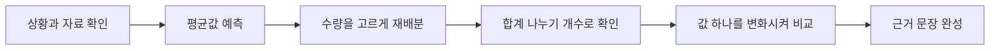

# Mean Balance Lab

> 한국어 서비스명: **평균 균형 조정실**  
> 문서 상태: 설계 확정 전 검토본 · 구현하지 않음  
> 작성일: 2026-08-26

## 1. 프로젝트 개요

| 항목 | 설계 내용 |
|---|---|
| 대상 | 초등 5~6학년 |
| 교과 | 수학 |
| 핵심 질문 | 평균은 여러 값을 어떻게 대표하며, 한 값이 달라지면 평균은 왜 움직일까요? |
| 한 차시 권장 시간 | 25~35분 |
| 실행 형태 | 서버·로그인 없는 정적 웹앱 |
| 핵심 산출물 | 조정 전후 자료, 평균 계산, 평균 변화에 대한 근거 문장 |

이 앱은 평균을 공식에 수를 대입하는 계산 절차가 아니라, **전체 양을 같은 수의 그릇에 고르게 재배분한 결과**로 먼저 경험하게 합니다. 이후 같은 평균을 가진 서로 다른 자료와 극단값이 포함된 자료를 비교하여 평균의 유용성과 한계를 함께 이해하도록 설계합니다.

## 2. 학습 문제와 설계 원칙

학생은 평균을 계산할 수 있어도 다음을 자주 혼동합니다.

- 평균이 실제 자료에 반드시 존재하는 값이라고 생각합니다.
- 평균이 같으면 자료의 모습도 같다고 생각합니다.
- 한 값이 크게 변할 때 평균이 왜 변하는지 설명하지 못합니다.
- 사람의 점수나 능력을 평균 하나로 평가해도 된다고 오해할 수 있습니다.

따라서 앱은 `전체 양 보존 → 고르게 옮기기 → 계산으로 확인 → 대표값의 한계 판단` 순서를 유지합니다. 실제 학생의 성적·키·몸무게는 사용하지 않고, 상자 속 구슬·독서 카드·수확 바구니처럼 비교 부담이 적은 가상 자료만 사용합니다.

## 3. 교육과정 연계와 학습 목표

- 2022 개정 교육과정 `[6수04-01]`: 평균의 의미를 알고 자료를 수집하여 평균을 구하고 해석하기
- 수학적 과정: 문제 해결, 추론, 의사소통, 정보 처리

| 수준 | 학습 목표 |
|---|---|
| 이해 | 평균을 전체 양을 고르게 나눈 값으로 설명합니다. |
| 적용 | 자료의 합과 개수를 이용해 평균을 구하고 조작 결과와 연결합니다. |
| 분석 | 평균은 같지만 분포가 다른 두 자료를 구별합니다. |
| 평가 | 평균만으로 판단하기 어려운 상황을 근거와 함께 설명합니다. |

## 4. 기존 앱과의 차별성

| 비교 대상 | 기존 앱의 중심 | 이 앱의 고유 중심 |
|---|---|---|
| 우리 반 통계청 | 투표 자료 수집과 그래프 비교 | 평균의 재배분 의미와 대표성 판단 |
| 그래프 눈금 수사대 | 축·단위가 만드는 시각적 왜곡 | 값 하나의 변화가 평균에 미치는 영향 |
| 씨앗 이동 전략실 | 확산 결과의 비교 | 동일한 총량을 균형 있게 나누는 수학적 모델 |

그래프 제작, 설문 수집, 실제 학급 통계는 MVP에 포함하지 않습니다.

## 5. 핵심 학습 흐름

각 단계는 이전 단계의 결과를 화면에 남깁니다. 학생이 계산만 맞히고 넘어가지 않도록 조작 결과와 설명을 함께 요구합니다.

## 6. 미션 구성

| 미션 | 핵심 활동 | 성공 근거 |
|---|---|---|
| 1. 균형 배송 | 4개 상자의 물건을 같은 수가 되도록 한 개씩 옮깁니다. | 총량이 보존되고 네 상자의 수가 같습니다. |
| 2. 평균 쌍둥이 | 평균은 같지만 모양이 다른 두 자료를 비교합니다. | 평균과 자료의 퍼짐이 다른 개념임을 말합니다. |
| 3. 튀는 값 경보 | 한 값을 크게 바꾼 뒤 평균 변화를 예측·확인합니다. | 합계 변화와 평균 변화를 연결합니다. |
| 4. 대표값 심의 | 평균만으로 결론 내리기 어려운 사례를 고릅니다. | 평균 외에 범위나 개별 값도 살펴야 하는 이유를 제시합니다. |

MVP 자료는 자연수 평균이 나오도록 구성합니다. 소수 평균과 중앙값 비교는 후속 확장으로 둡니다.

## 7. 화면 및 정보 구조

| 화면 | 주요 요소 | 학생 행동 |
|---|---|---|
| 시작 | 오늘의 질문, 학습 목표, 난이도 | 미션 시작 |
| 조정실 | 상자·수량 토큰, 합계 고정 표시, 실행 취소 | `-1`, `+1`, 상자 선택으로 재배분 |
| 계산 확인 | 합계, 자료 개수, 나눗셈 문장 | 빈칸 선택 또는 숫자 입력 |
| 비교실 | 조정 전후 자료와 평균, 점도표 | 공통점·차이점 선택 |
| 설명실 | 근거 문장 틀과 핵심어 | 근거 문장 완성 |
| 결과 | 미션별 근거, 다시 해보기, 교사용 요약 | 오답 수정 또는 종료 |

드래그는 보조 수단으로만 제공하고, 모든 조작은 버튼과 키보드로 완료할 수 있어야 합니다.

## 8. 학습 모델과 상태 규칙

- `합계`는 학생이 상자 사이에서 수량을 옮기는 동안 반드시 보존됩니다.
- 평균 확인값은 `합계 ÷ 자료 개수`로 계산하며 표시값과 내부값을 분리하지 않습니다.
- 극단값 미션에서는 변경 전후의 합계 차이를 먼저 보여 준 뒤 평균 차이를 연결합니다.
- 점도표는 자료의 모양을 보조할 뿐, 그래프 작도 기능으로 확장하지 않습니다.
- 실제 세계를 정밀하게 측정하는 앱이 아니라 교육용 이산 모형임을 결과 화면에 표시합니다.

## 9. 피드백과 평가

정답 여부보다 학생이 어떤 근거를 사용했는지를 기록합니다.

| 평가 요소 | 3단계 | 2단계 | 1단계 |
|---|---|---|---|
| 평균의 의미 | 재배분과 나눗셈을 연결해 설명 | 둘 중 한 방식으로 설명 | 계산 결과만 제시 |
| 변화 추론 | 합계 변화로 평균 방향과 크기를 설명 | 변화 방향만 맞게 설명 | 추측만 제시 |
| 대표성 판단 | 평균의 유용성과 한계를 사례로 설명 | 한계 또는 유용성만 설명 | 평균을 항상 정답으로 간주 |

오답 피드백은 `틀렸습니다`로 끝내지 않고, “전체 양은 그대로인가요?”, “자료는 몇 개인가요?”처럼 다음 확인 행동을 안내합니다. 자유 서술은 자동 점수화하지 않으며, 선택한 근거와 문장 틀만 즉시 피드백합니다.

## 10. UI·접근성 설계

- 최소 터치 영역 44×44px, 저시력 사용자를 고려한 4.5:1 이상의 명암비를 사용합니다.
- 색뿐 아니라 무늬·숫자·라벨로 상자를 구분합니다.
- 현재 단계에서 반드시 눌러야 하는 한 개의 버튼에만 `gi-pulse` 아우라 강조를 적용합니다.
- `prefers-reduced-motion` 환경에서는 깜빡임 대신 굵은 테두리와 `다음 행동` 문구를 표시합니다.
- 키보드 초점 순서, 스크린 리더용 수량 변화 알림, 실행 취소 기능을 제공합니다.
- 큰 글자에서도 가로 스크롤 없이 핵심 과정을 완료할 수 있게 한 열 레이아웃으로 전환합니다.

## 11. 기술 구조 설계

- 권장 구조: Vite + React + TypeScript 기반 정적 SPA
- 계산 규칙과 미션 콘텐츠를 UI 컴포넌트에서 분리합니다.
- 미션 데이터는 검수 가능한 로컬 JSON/TypeScript 객체로 관리합니다.
- 진행 상태는 기본적으로 현재 탭에만 유지하며, 선택적으로 기기 로컬 저장을 허용합니다.
- 서버, 계정, 광고, 분석 추적기, 외부 AI API를 사용하지 않습니다.
- 결과 내보내기는 개인정보 없는 인쇄용 요약으로 제한합니다.

## 12. 개인정보·안전·교육적 한계

- 이름, 학번, 성적, 신체 자료를 입력받지 않습니다.
- 실제 학생 집단을 평균으로 서열화하는 사례를 제공하지 않습니다.
- 평균 하나가 공정성이나 개인의 가치를 결정하지 않는다는 안내를 포함합니다.
- 브라우저 저장 기능이 켜져도 응답은 해당 기기에만 남으며 공유·동기화되지 않음을 명시합니다.

## 13. MVP 범위와 제외 항목

### MVP 포함

- 4개 미션, 각 2개 자료 세트
- 버튼 기반 재배분, 평균 계산, 전후 비교
- 근거 선택과 문장 틀
- 교사용 한 화면 활동 요약
- 반응형·키보드·모션 감소 대응

### MVP 제외

- 실제 학급 데이터 업로드
- 자유 서술 AI 채점
- 중앙값·최빈값과의 본격 비교
- 교사 계정, 온라인 대시보드, 학생 간 순위

## 14. 완료 기준

- 학생이 드래그 없이 전 미션을 완료할 수 있습니다.
- 모든 재배분에서 총량 보존 규칙이 깨지지 않습니다.
- 평균이 같은 다른 자료와 극단값 자료를 각각 한 번 이상 설명합니다.
- 새로 고침이나 뒤로 가기 후 잘못된 정답 상태가 남지 않습니다.
- 375px 모바일 화면, 키보드 전용 조작, 모션 감소 설정에서 핵심 흐름을 통과합니다.
- 결과 화면이 점수보다 사용한 근거와 수정 과정을 먼저 보여 줍니다.

## 15. 업데이트 내역 버튼 설계

화면 오른쪽 아래에 방해가 적은 작은 `업데이트 내역` 버튼을 둡니다. 대화상자에는 날짜, 구분, 변경 요약을 표시하고 키보드로 열고 닫을 수 있게 합니다.

| 날짜 | 구분 | 내역 |
|---|---|---|
| 2026-08-26 | 설계 | 최초 설계 문서 작성 |
| 구현일 입력 예정 | 개발 | MVP 구현 완료 시 실제 날짜와 범위 기록 |

## 16. 이번 문서의 경계

이 문서는 학습 경험과 제품 구조를 정의하는 설계 문서입니다. 소스 코드 생성, 프로젝트 폴더 생성, 테스트, 커밋, 배포, Hong's Vibe Coding Lab 등록은 포함하지 않습니다.
