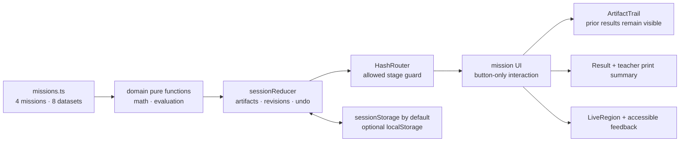

# Mean Balance Lab Implementation Plan

> **For agentic workers:** REQUIRED SUB-SKILL: Use superpowers:subagent-driven-development (recommended) or superpowers:executing-plans to implement this plan task-by-task. Steps use checkbox (`- [ ]`) syntax for tracking.

**Goal:** 초등 5~6학년 학생이 평균을 전체 양의 재배분으로 경험하고, 계산·분포 비교·극단값 변화·대표값의 한계를 근거와 함께 설명하는 서버 없는 한국어 정적 웹앱을 구축합니다.

**Architecture:** 검수 가능한 4개 미션·8개 자료 세트를 `src/content`에 두고, 총량 보존·평균·범위·판정 규칙은 순수 함수인 `src/domain`에 둡니다. `LabSessionProvider`의 reducer가 학습 산출물과 수정 이력을 관리하고 `HashRouter`가 단계별 URL과 뒤로 가기를 담당하며, 각 화면은 도메인 함수가 산출한 결과만 표시합니다. 기본 진행은 현재 탭의 `sessionStorage`에만 두고 학생이 명시적으로 선택한 경우에만 `localStorage`에 저장하며, 서버·계정·분석 추적·외부 API는 두지 않습니다.

**Tech Stack:** Vite, React, TypeScript, React Router DOM, CSS, Vitest, React Testing Library, `@testing-library/user-event`, `@testing-library/jest-dom`, Playwright, `@axe-core/playwright`, npm lockfile 기반 정적 SPA

**Spec:** `/Volumes/ External Drive 256G/Dev2/codex/mean-balance-lab/2026-08-26-mean-balance-lab-design.md`

## Global Constraints

- 대상은 초등 5~6학년이며, 한 차시는 25~35분이고, 모든 학생용 문구는 쉬운 존댓말 한국어로 작성합니다.
- 2022 개정 교육과정 `[6수04-01]`의 평균 의미·계산·해석과 문제 해결, 추론, 의사소통, 정보 처리 과정을 직접 지원합니다.
- 학습 순서는 `전체 양 보존 → 고르게 옮기기 → 합계 ÷ 자료 개수 → 같은 평균·다른 분포 → 한 값 변화 → 대표값의 한계 판단`을 유지합니다.
- 평균 표시값은 내부 계산값인 `sum(values) / values.length`를 그대로 사용하며 별도의 반올림된 판정값을 만들지 않습니다.
- MVP의 모든 자료는 자연수 평균을 가지며 소수 평균, 중앙값, 최빈값, 그래프 작도, 설문 수집, 실제 학급 통계는 구현하지 않습니다.
- 4개 미션에 각각 2개 자료 세트를 제공하되, 각 미션의 A 세트는 결과 화면 잠금 해제에 필요한 필수 세트이고 B 세트는 같은 개념을 다시 적용하는 선택 도전 세트입니다.
- 드래그는 구현하지 않습니다. 모든 핵심 흐름은 버튼과 키보드만으로 완료할 수 있어야 합니다.
- 재배분은 한 번에 정확히 1개를 한 상자에서 다른 상자로 옮기며, 성공한 모든 이동에서 총량과 상자 개수가 보존되어야 합니다.
- 점도표는 두 자료의 모양을 비교하는 읽기 전용 보조 표현이며 그래프 제작 도구로 확장하지 않습니다.
- 정답 여부보다 선택한 근거, 문장 틀, 수정 횟수를 먼저 저장하고 표시합니다. 자유 서술은 자동 점수화하지 않습니다.
- 오답 피드백은 단독 문구 `틀렸습니다`를 사용하지 않고 `전체 양은 그대로인가요?`, `자료는 몇 개인가요?`처럼 다음 확인 행동을 포함합니다.
- 이름, 학번, 성적, 키, 몸무게, 실제 학생 집단, 학생 간 순위를 입력·저장·예시화하지 않습니다.
- 결과 화면에는 `이 활동은 실제 세계를 정밀하게 측정하지 않는 교육용 이산 모형입니다.`와 `평균 하나가 공정성이나 개인의 가치를 결정하지 않습니다.`를 표시합니다.
- 서버, 로그인, 계정, 광고, 분석 추적기, 외부 AI API, 네트워크 동기화를 사용하지 않습니다.
- 기본 저장 범위는 현재 탭의 `sessionStorage`이고, `이 기기에 진행 저장`을 학생이 켠 경우에만 `localStorage`를 사용합니다. 두 저장 방식 모두 해당 기기 밖으로 공유·동기화되지 않음을 바로 옆에 알립니다.
- 모든 터치 대상의 최소 크기는 44×44px이고, 일반 텍스트와 배경의 명암비는 4.5:1 이상이어야 합니다.
- 상자는 색 외에 무늬, 번호, 텍스트 라벨을 함께 사용해 구분합니다.
- 현재 단계에서 반드시 눌러야 하는 버튼 정확히 한 개에만 `gi-pulse` 아우라를 적용합니다.
- `prefers-reduced-motion: reduce`에서는 `gi-pulse` 애니메이션을 제거하고 4px 굵은 테두리와 보이는 `다음 행동` 문구로 대체합니다.
- 키보드 초점 순서, 수량 변화 `aria-live` 알림, 실행 취소, 대화상자 초점 복귀를 지원합니다.
- 375px 너비와 큰 글자 환경에서 가로 스크롤 없이 한 열로 핵심 흐름을 완료할 수 있어야 합니다.
- 오른쪽 아래에 작은 `업데이트 내역` 버튼을 두고, 대화상자에 `2026-08-26 / 설계 / 최초 설계 문서 작성`과 `2026-08-26 / 개발 / 평균 균형 조정실 MVP 구현`을 기록합니다. 실제 실행이 2026-08-26 이후라면 두 번째 항목의 날짜만 구현 당일 Asia/Seoul 달력 날짜로 바꿉니다.
- 결과 내보내기는 개인정보 없는 인쇄용 한 화면 요약만 제공하며 파일 업로드·다운로드는 만들지 않습니다.
- 각 TypeScript, TSX, CSS 소스 파일은 500줄 미만으로 유지합니다. 한 파일이 450줄에 도달하면 다음 책임을 별도 파일로 분리합니다.
- 새로 고침·뒤로 가기 복원 시 완료된 근거는 유지할 수 있지만 현재 단계의 오답 판정, 성공 표시, 피드백 문구는 제거해 잘못된 정답 상태가 남지 않게 합니다.
- 이 계획을 작성하는 단계에서는 계획 문서 외 파일 생성·수정, 패키지 설치, Git 초기화, 커밋, 푸시, 배포를 실행하지 않습니다.

---

## Specification and Traceability

| 설계 요구 | 구현 연결 | 검증 연결 |
|---|---|---|
| 평균을 고른 재배분으로 이해 | Task 2의 `moveOne`, `isBalanced`; Task 6의 버튼 조정실 | 총량 속성 테스트, 키보드 재배분 E2E |
| 합과 개수로 평균 계산 | Task 2의 `mean`; Task 7의 `CalculationCheck` | 내부값·표시값 동일성 테스트 |
| 같은 평균·다른 분포 분석 | Task 1의 쌍둥이 자료; Task 8의 점도표·비교 | 평균 동일·범위 상이 테스트 |
| 한 값이 평균에 미치는 영향 | Task 1의 극단값 자료; Task 9의 전후 패널 | 합계 차이 선행 표시·평균 차이 테스트 |
| 평균의 유용성과 한계 판단 | Task 3의 근거 판정; Task 10의 대표값 심의 | 범위·개별 값 근거 선택 테스트 |
| 기존 앱과 차별화 | 그래프 제작·설문·실제 학급 자료를 Global Constraints와 Task 1 데이터 계약에서 배제 | 금지 입력·네트워크·그래프 편집 UI 부재 검사 |
| 이전 단계 결과를 계속 표시 | Task 4의 `StageArtifacts`; Task 5의 `ArtifactTrail` | 단계 이동 후 산출물 유지 컴포넌트 테스트 |
| 근거 중심 3단계 평가 | Task 3의 `EvidenceLevel`; Task 11의 결과 요약 | 점수보다 근거·수정 과정이 앞서는 DOM 순서 테스트 |
| 접근성·모바일·모션 감소 | Task 6의 `ActionButton`; Task 14의 CSS와 Playwright 검증 | 375px, 키보드, axe, reduced-motion E2E |
| 개인정보·안전·교육적 한계 | Task 10·11의 안전 문구; Task 12의 로컬 저장 | 금지 필드·외부 요청 부재·저장 안내 테스트 |
| MVP 4개 미션×2세트 | Task 1의 8개 고정 자료; Task 6~10 화면 | 스키마 검증과 A/B 세트 진입 E2E |
| 새로 고침·뒤로 가기 안전 | Task 4의 `sanitizeRestoredSession`; Task 5의 `resolveAllowedStage` | Task 15 복원·히스토리 E2E |
| 업데이트 내역 | Task 13의 고정 버튼·모달·날짜 데이터 | Escape, 초점 복귀, 날짜 렌더 테스트 |

## Architecture Flow



## Fixed Content Contract

| Mission ID | Dataset ID | 정확한 자료 | 평균·범위 또는 변화 | 단계 |
|---|---|---|---|---|
| `balance-delivery` | `balance-20-a` | `[2, 4, 6, 8]` → `[5, 5, 5, 5]` | 합 20, 평균 5 | situation, predict, redistribute, calculate, explain, mission-result |
| `balance-delivery` | `balance-24-b` | `[1, 5, 7, 11]` → `[6, 6, 6, 6]` | 합 24, 평균 6 | situation, predict, redistribute, calculate, explain, mission-result |
| `mean-twins` | `twins-4-a` | `[4, 4, 4, 4]` 대 `[1, 3, 5, 7]` | 평균 4·4, 범위 0·6 | situation, predict, calculate, compare, explain, mission-result |
| `mean-twins` | `twins-6-b` | `[6, 6, 6, 6]` 대 `[2, 4, 8, 10]` | 평균 6·6, 범위 0·8 | situation, predict, calculate, compare, explain, mission-result |
| `outlier-alert` | `outlier-5-a` | `[4, 5, 5, 6]` → `[4, 5, 5, 10]` | 합 +4, 평균 5→6 | situation, predict, calculate, compare, explain, mission-result |
| `outlier-alert` | `outlier-6-b` | `[5, 6, 6, 7]` → `[5, 6, 6, 15]` | 합 +8, 평균 6→8 | situation, predict, calculate, compare, explain, mission-result |
| `representative-review` | `review-cards-a` | `[2, 2, 2, 2, 12]` | 평균 4, 범위 10 | situation, predict, calculate, compare, explain, mission-result |
| `representative-review` | `review-baskets-b` | `[1, 1, 1, 9]` | 평균 3, 범위 8 | situation, predict, calculate, compare, explain, mission-result |

- `balance-delivery`의 맥락은 가상 포장 상자 속 구슬, `mean-twins`는 선반별 독서 카드, `outlier-alert`는 가상 수확 바구니, `representative-review`는 보급 상자 배치로 고정합니다.
- `review-cards-a`의 판단 문장은 `평균은 4장이지만 한 선반에 12장이 몰려 있어 범위와 각 값을 함께 봐야 합니다.`입니다.
- `review-baskets-b`의 판단 문장은 `평균은 3개이지만 세 보급 상자는 1개뿐이므로 평균만으로 모든 보급 상자의 상태를 말할 수 없습니다.`입니다.
- 결과 잠금 해제 필수 세트는 각 미션의 `-a` 세트이며, `-b` 세트는 결과 화면의 `다른 자료로 도전`에서 시작할 수 있습니다.

## Expected File Structure and Responsibilities

```text
mean-balance-lab/
├── 2026-08-26-mean-balance-lab-design.md             # 승인된 학습·제품 설계
├── 2026-08-26-mean-balance-lab-implementation-plan.md # 이 실행 계획
├── README.md                                           # 실행, 검증, 개인정보, 교육적 한계
├── package.json                                        # npm 명령과 런타임·테스트 의존성
├── package-lock.json                                   # 구현 시점에 고정한 의존성
├── index.html                                          # Vite 진입 HTML, 한국어 문서 언어
├── vite.config.ts                                      # React 플러그인과 정적 base 설정
├── vitest.config.ts                                    # jsdom·setup 설정
├── playwright.config.ts                               # Chromium, preview 서버, 뷰포트
├── tsconfig.json                                       # TypeScript project references
├── tsconfig.app.json                                   # strict 앱 컴파일 설정
├── tsconfig.node.json                                  # 도구 설정 파일 컴파일
├── src/
│   ├── main.tsx                                        # React root와 전역 CSS
│   ├── app/App.tsx                                     # provider·router 조합
│   ├── app/AppShell.tsx                                # skip link, header, main, footer
│   ├── app/router.tsx                                  # HashRouter 경로와 단계 보호
│   ├── app/router.test.tsx                             # route guard와 잘못된 URL 복구
│   ├── content/missions.ts                             # 검수 가능한 4개 미션·8개 세트
│   ├── content/missions.test.ts                        # 개수·평균·범위·변화 불변식
│   ├── content/documentation.test.ts                   # README 명령·안전 경계 계약
│   ├── content/copy.ts                                 # 공통 학습·안전·피드백 문구
│   ├── content/updateHistory.ts                        # 날짜·구분·변경 요약
│   ├── domain/types.ts                                 # 모든 판별 유니언과 공유 타입
│   ├── domain/math.ts                                  # 합·평균·범위·한 개 이동·점 빈도
│   ├── domain/math.test.ts                             # 총량·불변성·delta·점 빈도 테스트
│   ├── domain/evaluation.ts                            # 계산·비교·근거 3단계 판정
│   ├── domain/evaluation.test.ts                       # 행동 안내·12개 rubric 테스트
│   ├── domain/session.ts                               # reducer, 단계 산출물, 진행 잠금
│   ├── domain/session.test.ts                          # undo·gate·수정·완료 테스트
│   ├── state/LabSessionContext.tsx                     # reducer context와 dispatch hook
│   ├── state/persistence.ts                            # tab/device 저장과 안전 복원
│   ├── state/persistence.test.ts                       # schema·sanitize·storage 테스트
│   ├── hooks/useLiveAnnouncement.ts                   # 수량·피드백 알림 큐
│   ├── components/layout/ProgressRail.tsx              # 현재 미션·단계 표시
│   ├── components/layout/ArtifactTrail.tsx             # 이전 단계 결과 지속 표시
│   ├── components/layout/ArtifactTrail.test.tsx        # 이전 산출물 DOM 유지 테스트
│   ├── components/shared/ActionButton.tsx              # 단 하나의 gi-pulse 계약
│   ├── components/shared/ActionButton.test.tsx         # current-action 유일성 테스트
│   ├── components/shared/FeedbackPrompt.tsx            # 다음 확인 행동 피드백
│   ├── components/shared/LiveRegion.tsx                # aria-live 출력
│   ├── components/shared/DotPlot.tsx                   # 읽기 전용 시각·텍스트 점도표
│   ├── components/shared/DotPlot.test.tsx              # 시각값·대체 텍스트 일치 테스트
│   ├── components/start/StartScreen.tsx                # 질문, 목표, 난이도, 시작
│   ├── components/mission/MissionScreen.tsx            # 자료 종류별 단계 컴포넌트 선택
│   ├── components/mission/SituationPanel.tsx           # 가상 맥락과 원자료
│   ├── components/mission/PredictionPanel.tsx          # 평균·변화 예측 선택
│   ├── components/mission/RedistributionPanel.tsx      # 상자 선택, -1/+1, 실행 취소
│   ├── components/mission/RedistributionPanel.test.tsx # 이동·총량·undo·알림 테스트
│   ├── components/mission/CalculationCheck.tsx         # 합·개수·평균 입력·검증
│   ├── components/mission/CalculationCheck.test.tsx    # 입력 순서·동일 평균값 테스트
│   ├── components/mission/ComparisonPanel.tsx          # 전후·쌍둥이·범위 비교
│   ├── components/mission/ComparisonPanel.test.tsx     # 같은 평균·다른 퍼짐 테스트
│   ├── components/mission/OutlierDeltaPanel.tsx        # 합계 변화 다음 평균 변화 표시
│   ├── components/mission/OutlierDeltaPanel.test.tsx   # 변화값·표시 순서 테스트
│   ├── components/mission/EvidenceBuilder.tsx           # 근거 선택과 문장 틀
│   ├── components/mission/EvidenceBuilder.test.tsx      # 근거 단계·금지 입력 테스트
│   ├── components/mission/MissionSummary.tsx            # 미션 근거·수정·재도전
│   ├── components/result/ResultScreen.tsx               # 전체 근거 중심 결과
│   ├── components/result/ResultScreen.test.tsx          # 근거 우선 순서·완료 잠금 테스트
│   ├── components/result/TeacherSummary.tsx             # 한 화면 인쇄 요약
│   ├── components/result/TeacherSummary.test.tsx        # 익명 요약·인쇄 테스트
│   ├── components/settings/StoragePreference.tsx        # 명시적 기기 저장 동의
│   ├── components/settings/StoragePreference.test.tsx   # opt-in·clear·network 부재 테스트
│   ├── components/update/UpdateHistoryDialog.tsx        # 키보드 대화상자와 초점 복귀
│   ├── components/update/UpdateHistoryDialog.test.tsx   # 날짜·Escape·focus 테스트
│   ├── styles/tokens.css                                # 4.5:1 색·간격·44px 토큰
│   ├── styles/global.css                                # reset, focus, 한 열 반응형, print
│   ├── styles/components.css                            # gi-pulse, 패턴, 카드 스타일
│   ├── test/setup.ts                                    # jest-dom과 storage 정리
│   └── test/fixtures.tsx                                # 고정 콘텐츠 기반 reducer·render fixture
├── tests/
│   └── e2e/
│       ├── helpers/learner.ts                           # 공개 UI만 쓰는 학습 흐름 helper
│       ├── learner-flow.spec.ts                         # 버튼 전용 4개 미션 흐름
│       ├── history-and-restore.spec.ts                  # 뒤로 가기·새로 고침 안전
│       ├── accessibility.spec.ts                        # 키보드, axe, live region, dialog
│       └── responsive-motion.spec.ts                    # 375px, 큰 글자, reduced motion
└── docs/qa/mvp-checklist.md                             # 완료 기준과 실제 검증 기록 형식
```

## Shared Interfaces

아래 이름과 필드명은 모든 작업에서 그대로 사용합니다.

```ts
export type MissionId =
  | 'balance-delivery'
  | 'mean-twins'
  | 'outlier-alert'
  | 'representative-review';

export type DatasetId =
  | 'balance-20-a'
  | 'balance-24-b'
  | 'twins-4-a'
  | 'twins-6-b'
  | 'outlier-5-a'
  | 'outlier-6-b'
  | 'review-cards-a'
  | 'review-baskets-b';

export type LearningStage =
  | 'situation'
  | 'predict'
  | 'redistribute'
  | 'calculate'
  | 'compare'
  | 'explain'
  | 'mission-result';

export type BoxPattern = 'dots' | 'stripes' | 'grid' | 'waves';
export type SaveMode = 'tab' | 'device';
export type EvidenceLevel = 1 | 2 | 3;
export type CalculationTarget = 'current' | 'left' | 'right' | 'before' | 'after';
export type PredictionValue = number | 'increase' | 'decrease' | 'same';

export type ComparisonChoiceId =
  | 'same-mean'
  | 'different-spread'
  | 'same-shape'
  | 'sum-changed-first'
  | 'mean-changed-after'
  | 'range-or-individual-values'
  | 'mean-always-enough';

export interface BaseDataset {
  id: DatasetId;
  label: string;
  context: string;
  stages: readonly LearningStage[];
  expectedMean: number;
}

export interface BalanceDataset extends BaseDataset {
  kind: 'balance';
  values: readonly number[];
  targetValues: readonly number[];
}

export interface TwinDataset extends BaseDataset {
  kind: 'twins';
  leftValues: readonly number[];
  rightValues: readonly number[];
}

export interface OutlierDataset extends BaseDataset {
  kind: 'outlier';
  beforeValues: readonly number[];
  afterValues: readonly number[];
  changedIndex: number;
}

export interface ReviewDataset extends BaseDataset {
  kind: 'representativeness';
  values: readonly number[];
  acceptedEvidenceIds: readonly EvidenceChoiceId[];
  modelSentence: string;
}

export type MissionDataset =
  | BalanceDataset
  | TwinDataset
  | OutlierDataset
  | ReviewDataset;

export interface MissionDefinition {
  id: MissionId;
  title: string;
  learningGoal: string;
  requiredDatasetId: DatasetId;
  datasets: readonly MissionDataset[];
}

export type EvidenceChoiceId =
  | 'redistribution-and-division'
  | 'redistribution-only'
  | 'calculation-only'
  | 'same-mean-and-different-spread'
  | 'same-mean-only'
  | 'same-shape'
  | 'sum-change-and-mean-change'
  | 'direction-only'
  | 'guess-only'
  | 'mean-use-and-limit'
  | 'range-or-individual-values'
  | 'mean-always-enough';

export interface EvaluationResult {
  isCorrect: boolean;
  message: string;
  nextAction: string;
}

export interface EvidenceRecord {
  missionId: MissionId;
  datasetId: DatasetId;
  selectedIds: readonly EvidenceChoiceId[];
  sentence: string;
  level: EvidenceLevel;
  revisions: number;
}
```

## Test Fixture Contract

반복되는 테스트 준비 코드는 제품 코드에 숨은 테스트 전용 경로를 만들지 않고 아래 두 파일에만 둡니다.

- `src/test/fixtures.tsx`는 `renderAppAt(hash: string, initialState?: LabSessionState): RenderResult`, `verifiedBalanceArtifacts(): StageArtifacts`, `completedBalanceStateWithTwoRetries(): LabSessionState`, `stateWithCompletedEvidenceAndWrongFeedback(): LabSessionState`, `completedSession(): LabSessionState`, `sessionWithThreeRequiredMissions(): LabSessionState`, `invalidShapeSession(): unknown`을 내보냅니다. 유효한 fixture는 Fixed Content Contract의 배열과 `createInitialSession()`을 조합하며 임의의 다른 숫자를 만들지 않습니다. `invalidShapeSession`만 mission ID를 `unknown-mission`, 수량을 `-1`로 설정해 runtime guard의 거부 경로를 검증합니다.
- `tests/e2e/helpers/learner.ts`는 `startBalanceMission(page: Page): Promise<void>`, `completeBalanceWithButtons(page: Page): Promise<void>`, `completeRequiredDataset(page: Page, missionId: MissionId, datasetId: DatasetId): Promise<void>`, `expectChallengeValues(page: Page, datasetId: DatasetId, values: readonly number[]): Promise<void>`, `expectTwinChallengeValues(page: Page, datasetId: DatasetId, left: readonly number[], right: readonly number[]): Promise<void>`, `expectOutlierChallengeValues(page: Page, datasetId: DatasetId, before: readonly number[], after: readonly number[]): Promise<void>`, `reachCalculationAndSubmitWrongCount(page: Page): Promise<void>`를 내보냅니다. 각 함수는 공개 role·label만 조작하고 `page.evaluate`로 앱 상태를 주입하지 않습니다.
- 특정 컴포넌트 파일의 `renderBalancePanel`, `renderCalculationWithFeedback`, `renderTwinsComparison`, `renderOutlierDelta`, `renderEvidenceBuilder`, `renderResultScreen`, `renderStoragePreference`는 해당 테스트 파일 안에 두며, 실제 provider·reducer를 사용해 render하고 반환형은 Testing Library의 `RenderResult`입니다.
- `moveFromFourToOne(user)`는 `RedistributionPanel.test.tsx` 안에서 `4번 상자에서 1개 꺼내기`와 `1번 상자에 1개 넣기`를 차례로 누르는 `Promise<void>` helper입니다. `lastEvidenceRecord()`는 test spy가 마지막으로 받은 `EvidenceRecord`를 반환하고, `seedBothStorageKeys()`는 두 고정 storage key에 스키마 1 fixture를 넣습니다.

---

### Task 1: Bootstrap the Static App and Lock the Eight-Dataset Content Contract

**Files:**
- Create: `package.json`
- Create: `package-lock.json` through the listed future npm commands
- Create: `index.html`
- Create: `vite.config.ts`
- Create: `vitest.config.ts`
- Create: `tsconfig.json`
- Create: `tsconfig.app.json`
- Create: `tsconfig.node.json`
- Create: `src/main.tsx`
- Create: `src/test/setup.ts`
- Create: `src/domain/types.ts`
- Create: `src/domain/math.ts`
- Create: `src/content/missions.ts`
- Test: `src/content/missions.test.ts`

**Interfaces:**
- Consumes: the Fixed Content Contract and Shared Interfaces in this plan.
- Produces: `MISSIONS: readonly MissionDefinition[]`, `isMissionId(value: string): value is MissionId`, `isDatasetId(value: string): value is DatasetId`, `isLearningStage(value: string): value is LearningStage`, `getMission(missionId: MissionId): MissionDefinition`, `getDataset(datasetId: DatasetId): MissionDataset`, and all shared types exactly as declared above.

- [ ] **Step 1: Initialize Git only when execution is authorized**

Run later, from the project root:

```bash
git init -b main
```

Expected: Git reports an empty `main` repository. Do not run this command during plan writing.

- [ ] **Step 2: Add deterministic scripts and strict compiler/test configuration**

Write these scripts to `package.json`:

```json
{
  "name": "mean-balance-lab",
  "version": "0.1.0",
  "private": true,
  "type": "module",
  "scripts": {
    "dev": "vite",
    "build": "tsc -b && vite build",
    "preview": "vite preview",
    "typecheck": "tsc -b",
    "test": "vitest run",
    "test:watch": "vitest",
    "test:e2e": "playwright test",
    "check": "npm run typecheck && npm test && npm run build"
  }
}
```

After saving that manifest, run later:

```bash
npm install react react-dom react-router-dom
npm install --save-dev typescript vite @vitejs/plugin-react vitest jsdom @testing-library/react @testing-library/user-event @testing-library/jest-dom @types/react @types/react-dom @types/node @playwright/test @axe-core/playwright
```

Expected: npm preserves the exact name, version, privacy flag, module type, and scripts; it adds dependency sections and creates `package-lock.json` without an installation-blocking audit error.

Set `strict`, `noUncheckedIndexedAccess`, `exactOptionalPropertyTypes`, and `noFallthroughCasesInSwitch` to `true`; set Vite `base` to `'./'`; set Vitest environment to `jsdom` and setup file to `src/test/setup.ts`; set `<html lang="ko">` and page title to `평균 균형 조정실`.

- [ ] **Step 3: Write the failing content-schema test**

```ts
import { describe, expect, it } from 'vitest';
import { MISSIONS } from './missions';
import { mean, range, sum } from '../domain/math';

describe('MISSIONS', () => {
  it('contains four missions and exactly two unique datasets per mission', () => {
    expect(MISSIONS).toHaveLength(4);
    expect(MISSIONS.every((mission) => mission.datasets.length === 2)).toBe(true);
    expect(new Set(MISSIONS.flatMap((mission) => mission.datasets.map(({ id }) => id))).size).toBe(8);
  });

  it('uses natural-number means and valid required dataset ids', () => {
    for (const mission of MISSIONS) {
      expect(mission.datasets.some(({ id }) => id === mission.requiredDatasetId)).toBe(true);
      for (const dataset of mission.datasets) {
        expect(Number.isInteger(dataset.expectedMean)).toBe(true);
        const values = dataset.kind === 'twins' ? dataset.leftValues
          : dataset.kind === 'outlier' ? dataset.beforeValues
          : dataset.values;
        expect(mean(values)).toBe(dataset.expectedMean);
        if (dataset.kind === 'twins') expect(Number.isInteger(mean(dataset.rightValues))).toBe(true);
        if (dataset.kind === 'outlier') expect(Number.isInteger(mean(dataset.afterValues))).toBe(true);
      }
    }
  });

  it('fixes the concept-specific invariants', () => {
    const twins = MISSIONS[1].datasets;
    expect(twins.every((item) => item.kind === 'twins'
      && mean(item.leftValues) === mean(item.rightValues)
      && range(item.leftValues) !== range(item.rightValues))).toBe(true);
    const outliers = MISSIONS[2].datasets;
    expect(outliers.map((item) => item.kind === 'outlier'
      ? sum(item.afterValues) - sum(item.beforeValues) : 0)).toEqual([4, 8]);
  });
});
```

- [ ] **Step 4: Run the test to verify it fails**

Run later: `npm test -- src/content/missions.test.ts`

Expected: FAIL because `src/content/missions.ts` and `src/domain/math.ts` do not yet exist.

- [ ] **Step 5: Implement the minimum complete content registry**

Create the discriminated unions from Shared Interfaces and define `MISSIONS` with all eight exact datasets:

```ts
export const MISSIONS = [
  {
    id: 'balance-delivery',
    title: '1. 균형 배송',
    learningGoal: '전체 양을 보존하며 같은 수로 나누어요.',
    requiredDatasetId: 'balance-20-a',
    datasets: [
      {
        kind: 'balance', id: 'balance-20-a', label: '기본 구슬 상자',
        context: '가상 포장 상자 네 개의 구슬을 고르게 나눕니다.',
        stages: ['situation', 'predict', 'redistribute', 'calculate', 'explain', 'mission-result'],
        expectedMean: 5, values: [2, 4, 6, 8], targetValues: [5, 5, 5, 5],
      },
      {
        kind: 'balance', id: 'balance-24-b', label: '도전 구슬 상자',
        context: '다른 가상 포장 상자 네 개의 구슬을 고르게 나눕니다.',
        stages: ['situation', 'predict', 'redistribute', 'calculate', 'explain', 'mission-result'],
        expectedMean: 6, values: [1, 5, 7, 11], targetValues: [6, 6, 6, 6],
      },
    ],
  },
  {
    id: 'mean-twins',
    title: '2. 평균 쌍둥이',
    learningGoal: '평균이 같아도 자료의 모양은 다를 수 있어요.',
    requiredDatasetId: 'twins-4-a',
    datasets: [
      {
        kind: 'twins', id: 'twins-4-a', label: '평균 4 카드',
        context: '두 가상 선반의 독서 카드 수를 비교합니다.',
        stages: ['situation', 'predict', 'calculate', 'compare', 'explain', 'mission-result'],
        expectedMean: 4, leftValues: [4, 4, 4, 4], rightValues: [1, 3, 5, 7],
      },
      {
        kind: 'twins', id: 'twins-6-b', label: '평균 6 카드',
        context: '다른 두 가상 선반의 독서 카드 수를 비교합니다.',
        stages: ['situation', 'predict', 'calculate', 'compare', 'explain', 'mission-result'],
        expectedMean: 6, leftValues: [6, 6, 6, 6], rightValues: [2, 4, 8, 10],
      },
    ],
  },
  {
    id: 'outlier-alert',
    title: '3. 튀는 값 경보',
    learningGoal: '합계 변화와 평균 변화를 연결해요.',
    requiredDatasetId: 'outlier-5-a',
    datasets: [
      {
        kind: 'outlier', id: 'outlier-5-a', label: '4 증가 바구니',
        context: '가상 수확 바구니 하나의 수를 바꾸어 평균 변화를 살펴봅니다.',
        stages: ['situation', 'predict', 'calculate', 'compare', 'explain', 'mission-result'],
        expectedMean: 5, beforeValues: [4, 5, 5, 6], afterValues: [4, 5, 5, 10], changedIndex: 3,
      },
      {
        kind: 'outlier', id: 'outlier-6-b', label: '8 증가 바구니',
        context: '다른 가상 수확 바구니 하나의 수를 바꾸어 평균 변화를 살펴봅니다.',
        stages: ['situation', 'predict', 'calculate', 'compare', 'explain', 'mission-result'],
        expectedMean: 6, beforeValues: [5, 6, 6, 7], afterValues: [5, 6, 6, 15], changedIndex: 3,
      },
    ],
  },
  {
    id: 'representative-review',
    title: '4. 대표값 심의',
    learningGoal: '평균의 도움과 한계를 근거로 판단해요.',
    requiredDatasetId: 'review-cards-a',
    datasets: [
      {
        kind: 'representativeness', id: 'review-cards-a', label: '독서 카드 배치',
        context: '가상 선반별 독서 카드 배치를 평균만으로 설명할 수 있는지 살펴봅니다.',
        stages: ['situation', 'predict', 'calculate', 'compare', 'explain', 'mission-result'],
        expectedMean: 4, values: [2, 2, 2, 2, 12],
        acceptedEvidenceIds: ['mean-use-and-limit', 'range-or-individual-values'],
        modelSentence: '평균은 4장이지만 한 선반에 12장이 몰려 있어 범위와 각 값을 함께 봐야 합니다.',
      },
      {
        kind: 'representativeness', id: 'review-baskets-b', label: '보급 상자 배치',
        context: '가상 보급 상자 네 곳의 물건 수를 평균만으로 설명할 수 있는지 살펴봅니다.',
        stages: ['situation', 'predict', 'calculate', 'compare', 'explain', 'mission-result'],
        expectedMean: 3, values: [1, 1, 1, 9],
        acceptedEvidenceIds: ['mean-use-and-limit', 'range-or-individual-values'],
        modelSentence: '평균은 3개이지만 세 보급 상자는 1개뿐이므로 평균만으로 모든 보급 상자의 상태를 말할 수 없습니다.',
      },
    ],
  },
] as const satisfies readonly MissionDefinition[];
```

Implement `isMissionId` and `isDatasetId` from sets derived from `MISSIONS`, and `isLearningStage` from the seven literals in Shared Interfaces; the router must use these guards before calling `getMission`, `getDataset`, or `resolveAllowedStage`. Implement the two typed lookups as total functions that throw `Unknown mission: ${missionId}` or `Unknown dataset: ${datasetId}` only for programmer errors after validated input enters domain code.

- [ ] **Step 6: Add the minimum math exports needed by the content test**

```ts
export const sum = (values: readonly number[]): number =>
  values.reduce((total, value) => total + value, 0);

export const mean = (values: readonly number[]): number => {
  if (values.length === 0) throw new Error('Mean requires at least one value');
  return sum(values) / values.length;
};

export const range = (values: readonly number[]): number => {
  if (values.length === 0) throw new Error('Range requires at least one value');
  return Math.max(...values) - Math.min(...values);
};
```

- [ ] **Step 7: Run the focused test and typecheck**

Run later:

```bash
npm test -- src/content/missions.test.ts
npm run typecheck
```

Expected: 3 tests PASS; TypeScript exits 0 with no implicit `any`, missing discriminant, or unsafe indexed-access error.

- [ ] **Step 8: Commit the foundation**

```bash
git add package.json package-lock.json index.html vite.config.ts vitest.config.ts tsconfig.json tsconfig.app.json tsconfig.node.json src/main.tsx src/test/setup.ts src/domain/types.ts src/domain/math.ts src/content/missions.ts src/content/missions.test.ts
git commit -m "chore: scaffold mean balance lab content"
```

Expected: one commit containing only the runnable foundation, fixed content registry, and passing content tests.

---

### Task 2: Implement Invariant-Safe Mean and Redistribution Rules

**Files:**
- Modify: `src/domain/math.ts`
- Test: `src/domain/math.test.ts`

**Interfaces:**
- Consumes: numeric arrays from `MissionDataset`.
- Produces: `sum(values)`, `mean(values)`, `range(values)`, `isBalanced(values)`, `nextBalancingMove(values)`, `moveOne(values, move)`, `describeDelta(before, after)`, and `dotFrequencies(values)` with the exact signatures below.

```ts
export interface QuantityMove { fromIndex: number; toIndex: number }
export type MoveFailureReason = 'same-box' | 'source-empty' | 'out-of-range';
export type MoveResult =
  | { ok: true; values: readonly number[]; moved: 1 }
  | { ok: false; values: readonly number[]; reason: MoveFailureReason };
export interface DeltaSummary { sumBefore: number; sumAfter: number; sumDelta: number; meanBefore: number; meanAfter: number; meanDelta: number }
export interface DotFrequency { value: number; count: number }
```

- [ ] **Step 1: Write failing invariant tests**

```ts
it('moves exactly one item and preserves total and length', () => {
  const before = [2, 4, 6, 8];
  const result = moveOne(before, { fromIndex: 3, toIndex: 0 });
  expect(result).toEqual({ ok: true, values: [3, 4, 6, 7], moved: 1 });
  if (result.ok) {
    expect(sum(result.values)).toBe(sum(before));
    expect(result.values).toHaveLength(before.length);
  }
  expect(before).toEqual([2, 4, 6, 8]);
});

it.each([
  [{ fromIndex: 0, toIndex: 0 }, 'same-box'],
  [{ fromIndex: 0, toIndex: 1 }, 'source-empty'],
  [{ fromIndex: -1, toIndex: 1 }, 'out-of-range'],
] as const)('rejects invalid move %o', (move, reason) => {
  expect(moveOne([0, 5], move)).toEqual({ ok: false, values: [0, 5], reason });
});

it('summarizes sum change before mean change', () => {
  expect(describeDelta([4, 5, 5, 6], [4, 5, 5, 10])).toEqual({
    sumBefore: 20, sumAfter: 24, sumDelta: 4,
    meanBefore: 5, meanAfter: 6, meanDelta: 1,
  });
});

it('chooses one deterministic recommended move toward the mean', () => {
  expect(nextBalancingMove([2, 4, 6, 8])).toEqual({ fromIndex: 2, toIndex: 0 });
  expect(nextBalancingMove([5, 5, 5, 5])).toBeNull();
});

it('builds sorted read-only dot frequencies', () => {
  expect(dotFrequencies([4, 1, 4, 3])).toEqual([
    { value: 1, count: 1 }, { value: 3, count: 1 }, { value: 4, count: 2 },
  ]);
});
```

- [ ] **Step 2: Run the domain test to verify failure**

Run later: `npm test -- src/domain/math.test.ts`

Expected: FAIL with missing exports `moveOne`, `nextBalancingMove`, `describeDelta`, `dotFrequencies`, and `isBalanced`.

- [ ] **Step 3: Implement the minimum immutable domain functions**

```ts
export const isBalanced = (values: readonly number[]): boolean =>
  values.length > 0 && values.every((value) => value === values[0]);

export const nextBalancingMove = (values: readonly number[]): QuantityMove | null => {
  if (values.length === 0 || !Number.isInteger(mean(values))) return null;
  const target = mean(values);
  const fromIndex = values.findIndex((value) => value > target);
  const toIndex = values.findIndex((value) => value < target);
  return fromIndex >= 0 && toIndex >= 0 ? { fromIndex, toIndex } : null;
};

export function moveOne(values: readonly number[], move: QuantityMove): MoveResult {
  const { fromIndex, toIndex } = move;
  const source = values[fromIndex];
  const destination = values[toIndex];
  if (source === undefined || destination === undefined) {
    return { ok: false, values, reason: 'out-of-range' };
  }
  if (fromIndex === toIndex) return { ok: false, values, reason: 'same-box' };
  if (source === 0) return { ok: false, values, reason: 'source-empty' };
  const next = [...values];
  next[fromIndex] = source - 1;
  next[toIndex] = destination + 1;
  return { ok: true, values: next, moved: 1 };
}
```

Implement `describeDelta` only when both arrays are non-empty and have equal length; otherwise throw `Delta requires equal non-empty datasets`. Implement `dotFrequencies` by sorting unique natural values ascending without mutating its input.

- [ ] **Step 4: Run the focused test suite**

Run later: `npm test -- src/domain/math.test.ts src/content/missions.test.ts`

Expected: all math and content tests PASS; every successful `moveOne` retains the original sum and length.

- [ ] **Step 5: Commit the domain rules**

```bash
git add src/domain/math.ts src/domain/math.test.ts
git commit -m "feat: add invariant-safe mean model"
```

---

### Task 3: Implement Actionable Feedback and Three-Level Evidence Evaluation

**Files:**
- Create: `src/content/copy.ts`
- Create: `src/domain/evaluation.ts`
- Test: `src/domain/evaluation.test.ts`

**Interfaces:**
- Consumes: `MissionDataset`, `EvidenceChoiceId`, `sum`, `mean`, `range`, and student selections.
- Produces: `evaluateCalculation(input: CalculationInput): EvaluationResult`, `evaluateComparison(dataset: MissionDataset, selectedIds: readonly ComparisonChoiceId[]): EvaluationResult`, `deriveEvidenceLevel(missionId: MissionId, selectedIds: readonly EvidenceChoiceId[]): EvidenceLevel`, and `buildEvidenceSentence(missionId: MissionId, datasetId: DatasetId, selectedIds: readonly EvidenceChoiceId[]): string`.

```ts
export interface CalculationInput {
  values: readonly number[];
  enteredTotal: number;
  enteredCount: number;
  enteredMean: number;
}
```

- [ ] **Step 1: Write failing feedback and rubric tests**

```ts
it('guides the next check instead of ending with a wrong label', () => {
  const result = evaluateCalculation({ values: [2, 4, 6, 8], enteredTotal: 19, enteredCount: 4, enteredMean: 5 });
  expect(result).toEqual({
    isCorrect: false,
    message: '상자 속 수를 다시 모두 더해 보세요.',
    nextAction: '전체 양은 그대로인지 확인해 보세요.',
  });
  expect(`${result.message} ${result.nextAction}`).not.toContain('틀렸습니다');
});

it.each([
  ['balance-delivery', ['redistribution-and-division'], 3],
  ['balance-delivery', ['redistribution-only'], 2],
  ['balance-delivery', ['calculation-only'], 1],
  ['mean-twins', ['same-mean-and-different-spread'], 3],
  ['mean-twins', ['same-mean-only'], 2],
  ['mean-twins', ['same-shape'], 1],
  ['outlier-alert', ['sum-change-and-mean-change'], 3],
  ['outlier-alert', ['direction-only'], 2],
  ['outlier-alert', ['guess-only'], 1],
  ['representative-review', ['mean-use-and-limit', 'range-or-individual-values'], 3],
  ['representative-review', ['range-or-individual-values'], 2],
  ['representative-review', ['mean-always-enough'], 1],
] as const)('maps %s evidence to level %i', (missionId, ids, expected) => {
  expect(deriveEvidenceLevel(missionId, ids)).toBe(expected);
});
```

- [ ] **Step 2: Run the evaluator test to verify failure**

Run later: `npm test -- src/domain/evaluation.test.ts`

Expected: FAIL because the evaluation module does not exist.

- [ ] **Step 3: Implement minimal calculation checks in fixed order**

`evaluateCalculation` must compare total, then count, then mean so feedback follows the learning model:

```ts
if (input.enteredTotal !== sum(input.values)) {
  return { isCorrect: false, message: '상자 속 수를 다시 모두 더해 보세요.', nextAction: '전체 양은 그대로인지 확인해 보세요.' };
}
if (input.enteredCount !== input.values.length) {
  return { isCorrect: false, message: '자료 칸의 개수를 다시 세어 보세요.', nextAction: '자료는 몇 개인가요?' };
}
if (input.enteredMean !== mean(input.values)) {
  return { isCorrect: false, message: '합계를 자료 개수로 나누어 보세요.', nextAction: `${sum(input.values)} ÷ ${input.values.length}를 계산해 보세요.` };
}
return { isCorrect: true, message: '재배분한 값과 계산한 평균이 같아요.', nextAction: '근거를 남기고 다음 단계로 가세요.' };
```

Implement the twelve exact rubric rows in the failing test. `buildEvidenceSentence` must assemble only reviewed choice fragments; it must not inspect or score arbitrary text.

- [ ] **Step 4: Add comparison-specific checks**

- Twins require `same-mean` and `different-spread` selections.
- Outlier requires `sum-changed-first` and `mean-changed-after` selections.
- Representative review requires `range-or-individual-values`; `mean-always-enough` always produces retry guidance.
- Every unsuccessful result contains a concrete `nextAction` and no standalone wrong label.

- [ ] **Step 5: Run tests and typecheck**

Run later:

```bash
npm test -- src/domain/evaluation.test.ts
npm run typecheck
```

Expected: rubric rows and feedback ordering PASS; TypeScript confirms all mission IDs are exhaustively handled.

- [ ] **Step 6: Commit the evaluation model**

```bash
git add src/content/copy.ts src/domain/evaluation.ts src/domain/evaluation.test.ts
git commit -m "feat: add evidence evaluation rules"
```

---

### Task 4: Build Recoverable Session State, Undo, and Safe Restoration

**Files:**
- Create: `src/domain/session.ts`
- Create: `src/state/persistence.ts`
- Create: `src/state/LabSessionContext.tsx`
- Create: `src/test/fixtures.tsx`
- Test: `src/domain/session.test.ts`
- Test: `src/state/persistence.test.ts`

**Interfaces:**
- Consumes: `MissionId`, `DatasetId`, `LearningStage`, `EvidenceRecord`, `moveOne`, and Web Storage compatible objects.
- Produces: `LabSessionState`, `LabAction`, `createInitialSession()`, `sessionReducer(state, action)`, `canAdvance(state)`, `sanitizeRestoredSession(state)`, `isLabSessionState(value: unknown): value is LabSessionState`, `loadSession(storage, key)`, `saveSession(storage, key, state)`, `LabSessionProvider`, and `useLabSession()`.

```ts
export interface CalculationArtifact {
  target: CalculationTarget;
  total: number;
  count: number;
  average: number;
  verified: boolean;
}

export interface StageArtifacts {
  prediction?: { value: PredictionValue };
  redistribution?: { initialValues: readonly number[]; currentValues: readonly number[]; undoStack: readonly (readonly number[])[] };
  calculations?: Partial<Record<CalculationTarget, CalculationArtifact>>;
  comparison?: { selectedIds: readonly ComparisonChoiceId[]; verified: boolean };
  evidence?: EvidenceRecord;
}

export type AdvanceGate = { allowed: true } | { allowed: false; reason: string };

export interface ActiveRun {
  missionId: MissionId;
  datasetId: DatasetId;
  stage: LearningStage;
  artifacts: StageArtifacts;
  revisions: number;
  transientFeedback: EvaluationResult | null;
}

export interface LabSessionState {
  schemaVersion: 1;
  saveMode: SaveMode;
  activeRun: ActiveRun | null;
  attempts: Partial<Record<DatasetId, EvidenceRecord>>;
  completedRequiredMissions: readonly MissionId[];
}
```

- [ ] **Step 1: Write failing reducer tests**

```ts
it('supports one-item movement and undo without losing total', () => {
  const started = sessionReducer(createInitialSession(), { type: 'START_DATASET', missionId: 'balance-delivery', datasetId: 'balance-20-a' });
  const moved = sessionReducer(started, { type: 'MOVE_ONE', move: { fromIndex: 3, toIndex: 0 } });
  const undone = sessionReducer(moved, { type: 'UNDO_MOVE' });
  expect(undone.activeRun?.artifacts.redistribution?.currentValues).toEqual([2, 4, 6, 8]);
});

it('does not advance until the current artifact is verified', () => {
  const started = sessionReducer(createInitialSession(), { type: 'START_DATASET', missionId: 'mean-twins', datasetId: 'twins-4-a' });
  const predictionStage = sessionReducer(started, { type: 'ADVANCE_STAGE' });
  expect(predictionStage.activeRun?.stage).toBe('predict');
  expect(canAdvance(predictionStage)).toEqual({ allowed: false, reason: '먼저 평균을 예측해 보세요.' });
});

it('records revision count and required mission completion', () => {
  const state = completedBalanceStateWithTwoRetries();
  expect(state.activeRun?.revisions).toBe(2);
  expect(state.completedRequiredMissions).toContain('balance-delivery');
});
```

- [ ] **Step 2: Run reducer tests to verify failure**

Run later: `npm test -- src/domain/session.test.ts`

Expected: FAIL because reducer types and functions do not exist.

- [ ] **Step 3: Implement the exhaustive reducer**

Define these actions exactly:

```ts
export type LabAction =
  | { type: 'START_DATASET'; missionId: MissionId; datasetId: DatasetId }
  | { type: 'SET_PREDICTION'; value: PredictionValue }
  | { type: 'MOVE_ONE'; move: QuantityMove }
  | { type: 'UNDO_MOVE' }
  | { type: 'SUBMIT_CALCULATION'; target: CalculationTarget; input: CalculationInput }
  | { type: 'SET_COMPARISON'; selectedIds: readonly ComparisonChoiceId[] }
  | { type: 'SUBMIT_EVIDENCE'; record: EvidenceRecord }
  | { type: 'ADVANCE_STAGE' }
  | { type: 'SET_SAVE_MODE'; mode: SaveMode }
  | { type: 'RESET_ACTIVE_DATASET' }
  | { type: 'RESET_ALL' }
  | { type: 'RESTORE'; state: LabSessionState };
```

Every rejected submission increments `revisions`; `ADVANCE_STAGE` calls `canAdvance`; `MOVE_ONE` appends the previous array to `undoStack`; `UNDO_MOVE` removes only the latest snapshot; completion adds a mission only when its `requiredDatasetId` is completed.

`canAdvance` uses these exhaustive gates: `situation` is allowed after the dataset loads; `predict` requires `artifacts.prediction`; `redistribute` requires `isBalanced(currentValues)` and unchanged total; `calculate` requires `current` for balance/review, `left` plus `right` for twins, and `before` plus `after` for outlier, with every required target verified; `compare` requires `comparison.verified`; `explain` requires `evidence`; `mission-result` allows the selected next mission or results route. Each false gate returns the specific next-action sentence used by its panel.

- [ ] **Step 4: Write failing persistence sanitization tests**

```ts
it('restores completed evidence but clears current-stage judgment', () => {
  const restored = sanitizeRestoredSession(stateWithCompletedEvidenceAndWrongFeedback());
  expect(restored.attempts['balance-20-a']).toBeDefined();
  expect(restored.activeRun?.transientFeedback).toBeNull();
  expect(restored.activeRun?.artifacts.calculations?.current?.verified).toBe(false);
});

it('rejects another schema version without throwing', () => {
  sessionStorage.setItem('mean-balance-lab:tab:v1', JSON.stringify({ schemaVersion: 2 }));
  expect(loadSession(sessionStorage, 'mean-balance-lab:tab:v1')).toBeNull();
});

it('rejects schema-one data with an invalid mission id or negative quantity', () => {
  sessionStorage.setItem('mean-balance-lab:tab:v1', JSON.stringify(invalidShapeSession()));
  expect(loadSession(sessionStorage, 'mean-balance-lab:tab:v1')).toBeNull();
});
```

- [ ] **Step 5: Implement storage helpers and provider effects**

Use exact keys:

```ts
export const TAB_STORAGE_KEY = 'mean-balance-lab:tab:v1';
export const DEVICE_STORAGE_KEY = 'mean-balance-lab:device:v1';
```

`LabSessionProvider` loads tab state first. It loads device state only when the stored object itself has `saveMode: 'device'`; switching back to `tab` removes `DEVICE_STORAGE_KEY`; `RESET_ALL` removes both keys. `isLabSessionState` validates schema version, save mode, mission/dataset/stage IDs, nonnegative natural quantities, evidence choice IDs, and revision counts before any restored value reaches the reducer; JSON parse errors and invalid shapes return `null`. `sanitizeRestoredSession` clears `transientFeedback`; when `activeRun.stage` is `calculate`, it also changes every current calculation target’s `verified` flag to `false`, while calculations already shown as prior artifacts in `compare`, `explain`, or `mission-result` remain verified. No storage payload may include a name, identifier, free-text field, network address, or timestamp tied to a person.

- [ ] **Step 6: Run focused state tests**

Run later: `npm test -- src/domain/session.test.ts src/state/persistence.test.ts`

Expected: reducer, undo, revision, required-set completion, schema rejection, and transient-feedback sanitization tests PASS.

- [ ] **Step 7: Commit state management**

```bash
git add src/domain/session.ts src/domain/session.test.ts src/state/persistence.ts src/state/persistence.test.ts src/state/LabSessionContext.tsx src/test/fixtures.tsx
git commit -m "feat: add recoverable session state"
```

---

### Task 5: Add the Routed Learning Shell and Persistent Artifact Trail

**Files:**
- Create: `src/app/App.tsx`
- Create: `src/app/AppShell.tsx`
- Create: `src/app/router.tsx`
- Create: `src/components/start/StartScreen.tsx`
- Create: `src/components/layout/ProgressRail.tsx`
- Create: `src/components/layout/ArtifactTrail.tsx`
- Create: `src/components/mission/MissionScreen.tsx`
- Create: `src/components/mission/SituationPanel.tsx`
- Create: `src/components/mission/PredictionPanel.tsx`
- Create: `src/components/result/ResultScreen.tsx`
- Modify: `src/main.tsx`
- Modify: `src/test/fixtures.tsx`
- Test: `src/app/router.test.tsx`
- Test: `src/components/layout/ArtifactTrail.test.tsx`

**Interfaces:**
- Consumes: `MISSIONS`, `isMissionId`, `isDatasetId`, `isLearningStage`, `LabSessionProvider`, `useLabSession()`, `LearningStage`, and `StageArtifacts`.
- Produces: `routeFor(missionId: MissionId, datasetId: DatasetId, stage: LearningStage): string`, `resolveAllowedStage(state: LabSessionState, mission: MissionDefinition, dataset: MissionDataset, requestedStage: LearningStage): LearningStage`, `App`, `AppShell`, `StartScreen`, `ProgressRail`, `ArtifactTrail`, the test helper `renderAppAt`, and an initial locked `ResultScreen` route target.

- [ ] **Step 1: Write failing route-guard and artifact tests**

```tsx
it('redirects an unverified deep link to the first allowed stage', async () => {
  renderAppAt('#/mission/mean-twins/twins-4-a/compare');
  expect(await screen.findByRole('heading', { name: '평균을 먼저 예측해 볼까요?' })).toBeVisible();
  expect(window.location.hash).toContain('/predict');
});

it('keeps verified prior artifacts visible after stage advance', () => {
  render(<ArtifactTrail artifacts={verifiedBalanceArtifacts()} />);
  expect(screen.getByText('예측: 평균 5')).toBeVisible();
  expect(screen.getByText('재배분: 5, 5, 5, 5')).toBeVisible();
  expect(screen.getByText('20 ÷ 4 = 5')).toBeVisible();
});
```

- [ ] **Step 2: Run tests to verify failure**

Run later: `npm test -- src/app/router.test.tsx src/components/layout/ArtifactTrail.test.tsx`

Expected: FAIL because the router and layout components do not exist.

- [ ] **Step 3: Implement exact hash routes and guard**

```tsx
<HashRouter>
  <Routes>
    <Route element={<AppShell />}>
      <Route index element={<StartScreen />} />
      <Route path="mission/:missionId/:datasetId/:stage" element={<MissionScreen />} />
      <Route path="results" element={<ResultScreen />} />
      <Route path="*" element={<Navigate to="/" replace />} />
    </Route>
  </Routes>
</HashRouter>
```

`resolveAllowedStage` returns the requested stage only when every preceding stage in `dataset.stages` has the required artifact; otherwise it returns the first incomplete stage. An unknown mission/dataset pair navigates to `/` with the visible message `자료를 찾지 못해 시작 화면으로 돌아왔어요.`

At this commit, `MissionScreen` renders `situation` and `predict`; requests for `redistribute`, `calculate`, `compare`, `explain`, or `mission-result` redirect to the first incomplete one of those two stages. Tasks 6–11 replace each named redirect with its tested stage component and artifact gate before that stage becomes reachable. Create `ResultScreen.tsx` with the real locked-state output `<h1>전체 결과</h1>` and `네 미션의 필수 자료를 모두 마치면 근거를 모아 볼 수 있어요.` so the route compiles and communicates the actual lock contract; Task 11 expands this same file.

- [ ] **Step 4: Implement the shell and start screen**

Place a `본문으로 건너뛰기` skip link before the header. Show the exact core question `평균은 여러 값을 어떻게 대표하며, 한 값이 달라지면 평균은 왜 움직일까요?`, four learning goals, and a labeled difficulty choice `기본(A 세트)` or `도전(B 세트)`. Default to `기본(A 세트)` and show `기본 자료로 시작`; choosing B shows `도전 자료로 시작`. The only current action on the initial screen is `미션 시작`.

- [ ] **Step 5: Implement artifact persistence in the UI**

`MissionScreen` renders `ProgressRail`, then `ArtifactTrail`, then one stage component. `ArtifactTrail` omits unanswered rows but never hides verified prediction, redistribution, calculation, comparison, evidence, or revision count while moving forward in the same dataset.

- [ ] **Step 6: Run router and layout tests**

Run later: `npm test -- src/app/router.test.tsx src/components/layout/ArtifactTrail.test.tsx`

Expected: route guard, unknown route recovery, and all three prior-artifact assertions PASS.

- [ ] **Step 7: Commit the routed shell**

```bash
git add src/main.tsx src/app src/components/start src/components/layout src/components/mission/MissionScreen.tsx src/components/mission/SituationPanel.tsx src/components/mission/PredictionPanel.tsx src/components/result/ResultScreen.tsx src/test/fixtures.tsx
git commit -m "feat: add routed learning shell"
```

---

### Task 6: Build Button-Only Balance Redistribution with Undo and One Current Action

**Files:**
- Create: `src/hooks/useLiveAnnouncement.ts`
- Create: `src/components/shared/ActionButton.tsx`
- Create: `src/components/shared/LiveRegion.tsx`
- Create: `src/components/shared/FeedbackPrompt.tsx`
- Create: `src/components/mission/RedistributionPanel.tsx`
- Modify: `src/components/start/StartScreen.tsx`
- Modify: `src/components/mission/SituationPanel.tsx`
- Modify: `src/components/mission/PredictionPanel.tsx`
- Test: `src/components/mission/RedistributionPanel.test.tsx`
- Test: `src/components/shared/ActionButton.test.tsx`

**Interfaces:**
- Consumes: `BalanceDataset`, `LabAction`, `moveOne`, `isBalanced`, `nextBalancingMove`, and `EvaluationResult`.
- Produces: `ActionButton({ emphasis, ...buttonProps })`, `RedistributionPanel({ dataset, run, dispatch })`, and `useLiveAnnouncement(): { message: string; announce(message: string): void }`.

```ts
export interface ActionButtonProps extends React.ButtonHTMLAttributes<HTMLButtonElement> {
  emphasis?: 'next' | 'normal';
}
```

- [ ] **Step 1: Write failing interaction tests**

```tsx
it('moves one item using source and destination buttons and announces it', async () => {
  renderBalancePanel([2, 4, 6, 8]);
  await user.click(screen.getByRole('button', { name: '4번 상자에서 1개 꺼내기' }));
  await user.click(screen.getByRole('button', { name: '1번 상자에 1개 넣기' }));
  expect(screen.getByText('현재 수량 3, 4, 6, 7')).toBeVisible();
  expect(screen.getByRole('status')).toHaveTextContent('4번 상자에서 1개를 1번 상자로 옮겼어요. 전체는 20개로 같아요.');
});

it('undoes the latest successful move', async () => {
  renderBalancePanel([2, 4, 6, 8]);
  await moveFromFourToOne(user);
  await user.click(screen.getByRole('button', { name: '마지막 이동 취소' }));
  expect(screen.getByText('현재 수량 2, 4, 6, 8')).toBeVisible();
});

it('marks exactly one enabled next action', () => {
  renderBalancePanel([5, 5, 5, 5]);
  expect(screen.getAllByRole('button').filter((button) => button.dataset.currentAction === 'true')).toHaveLength(1);
});
```

- [ ] **Step 2: Run component tests to verify failure**

Run later: `npm test -- src/components/mission/RedistributionPanel.test.tsx src/components/shared/ActionButton.test.tsx`

Expected: FAIL because the panel, live region, and action button do not exist.

- [ ] **Step 3: Implement accessible source/destination controls**

Render each of four boxes with number, label, pattern class, numeric value, `-1` source button, and `+1` destination button. A move dispatches only after one source and one different destination are selected. Disable `-1` when a box is zero. Keep a fixed `합계 20개` or `합계 24개` display and reject any result whose sum differs from the dataset sum.

- [ ] **Step 4: Implement the single-current-action contract**

```tsx
export function ActionButton({ emphasis = 'normal', className = '', children, ...props }: ActionButtonProps) {
  const isNext = emphasis === 'next' && !props.disabled;
  return (
    <button
      {...props}
      data-current-action={isNext ? 'true' : undefined}
      className={`${className} ${isNext ? 'gi-pulse' : ''}`.trim()}
    >
      {children}
      {isNext && <span className="reduced-motion-next" aria-hidden="true">다음 행동</span>}
    </button>
  );
}
```

The panel calls `nextBalancingMove(currentValues)`. Before a source is selected it assigns `emphasis="next"` only to that result’s `fromIndex` source button; after source selection it assigns emphasis only to the first box below the integer mean as destination; after `isBalanced` becomes true it assigns emphasis only to `고르게 나누기 확인`. A student may choose another valid source or destination, but the recommended aura remains unique. All other buttons use `normal`.

Replace the start, situation, and prediction screens’ current navigation buttons with `ActionButton emphasis="next"`; their secondary controls use `emphasis="normal"`. From this commit forward, every newly added core submit/advance button must use the same component so the one-current-action contract has one implementation point.

- [ ] **Step 5: Implement undo and live announcements**

After a successful move, announce source, destination, new values, and unchanged total. After undo, announce `마지막 이동을 취소했어요. 전체는 20개로 같아요.` or the dataset’s total. Invalid same-box and empty-source operations show `FeedbackPrompt` with a next action and do not push undo history.

- [ ] **Step 6: Run focused tests**

Run later: `npm test -- src/components/mission/RedistributionPanel.test.tsx src/components/shared/ActionButton.test.tsx`

Expected: move, total, undo, live status, disabled-empty-source, and exactly-one-current-action tests PASS without drag events.

- [ ] **Step 7: Commit the redistribution UI**

```bash
git add src/hooks/useLiveAnnouncement.ts src/components/shared src/components/start/StartScreen.tsx src/components/mission/SituationPanel.tsx src/components/mission/PredictionPanel.tsx src/components/mission/RedistributionPanel.tsx src/components/mission/RedistributionPanel.test.tsx
git commit -m "feat: add button-only balance mission"
```

---

### Task 7: Connect Calculation Inputs to the Same Internal Mean Value

**Files:**
- Create: `src/components/mission/CalculationCheck.tsx`
- Modify: `src/components/mission/MissionScreen.tsx`
- Test: `src/components/mission/CalculationCheck.test.tsx`

**Interfaces:**
- Consumes: the active dataset values, `evaluateCalculation`, `EvaluationResult`, `SUBMIT_CALCULATION`, and `ActionButton`.
- Produces: `CalculationCheck({ target, values, onSubmit, feedback })`, where `target: CalculationTarget` and `onSubmit(target: CalculationTarget, input: CalculationInput): void`, with three labeled numeric inputs and a rendered equation using the same `sum` and `mean` exports used for validation.

- [ ] **Step 1: Write failing calculation tests**

```tsx
it('checks total, count, and mean in learning order', async () => {
  const onSubmit = vi.fn();
  render(<CalculationCheck target="current" values={[2, 4, 6, 8]} onSubmit={onSubmit} feedback={null} />);
  await user.type(screen.getByLabelText('합계'), '20');
  await user.type(screen.getByLabelText('자료 개수'), '4');
  await user.type(screen.getByLabelText('평균'), '5');
  await user.click(screen.getByRole('button', { name: '계산 확인' }));
  expect(onSubmit).toHaveBeenCalledWith('current', { values: [2, 4, 6, 8], enteredTotal: 20, enteredCount: 4, enteredMean: 5 });
});

it('shows an actionable retry and keeps the next action unique', async () => {
  renderCalculationWithFeedback({ isCorrect: false, message: '자료 칸의 개수를 다시 세어 보세요.', nextAction: '자료는 몇 개인가요?' });
  expect(screen.getByText('자료는 몇 개인가요?')).toBeVisible();
  expect(screen.queryByText('틀렸습니다')).not.toBeInTheDocument();
  expect(document.querySelectorAll('[data-current-action="true"]')).toHaveLength(1);
});
```

- [ ] **Step 2: Run tests to verify failure**

Run later: `npm test -- src/components/mission/CalculationCheck.test.tsx`

Expected: FAIL because `CalculationCheck` does not exist.

- [ ] **Step 3: Implement minimal calculation form**

Use `inputMode="numeric"`, `type="number"`, `min="0"`, explicit labels, and no default answer. Submit and advance controls use `ActionButton`. After success, render the equation from domain values, for example `20 ÷ 4 = 5`, and make `다음 단계` the sole current action. After failure, focus the first incorrect field and keep `계산 다시 확인` as the sole current action.

- [ ] **Step 4: Ensure all mission types provide the correct calculation array**

- Balance uses target `current` with the balanced `currentValues`.
- Twins uses target `left` for `leftValues` and target `right` for `rightValues` and requires both verified means.
- Outlier uses target `before` for `beforeValues` and target `after` for `afterValues`.
- Representative review uses target `current` with its single `values` array.

- [ ] **Step 5: Run focused and domain tests**

Run later: `npm test -- src/components/mission/CalculationCheck.test.tsx src/domain/evaluation.test.ts src/domain/math.test.ts`

Expected: all PASS; every equation’s displayed value equals `mean(values)` exactly.

- [ ] **Step 6: Commit calculation verification**

```bash
git add src/components/mission/CalculationCheck.tsx src/components/mission/CalculationCheck.test.tsx src/components/mission/MissionScreen.tsx
git commit -m "feat: add mean calculation verification"
```

---

### Task 8: Implement Same-Mean, Different-Distribution Comparison

**Files:**
- Create: `src/components/shared/DotPlot.tsx`
- Create: `src/components/mission/ComparisonPanel.tsx`
- Modify: `src/components/mission/MissionScreen.tsx`
- Test: `src/components/shared/DotPlot.test.tsx`
- Test: `src/components/mission/ComparisonPanel.test.tsx`

**Interfaces:**
- Consumes: `TwinDataset`, `dotFrequencies`, `range`, `mean`, `SET_COMPARISON`, `evaluateComparison`, and `ActionButton`.
- Produces: `DotPlot({ values, label })` and a twins mode in `ComparisonPanel({ dataset, artifacts, dispatch })`.

- [ ] **Step 1: Write failing dot-plot and comparison tests**

```tsx
it('exposes the same values visually and as screen-reader text', () => {
  render(<DotPlot values={[1, 3, 5, 7]} label="자료 B" />);
  expect(screen.getByRole('img', { name: '자료 B 점도표: 1, 3, 5, 7' })).toBeVisible();
  expect(screen.getByText('자료 B 값 목록: 1, 3, 5, 7')).toHaveClass('sr-only');
});

it('requires both same mean and different spread evidence', async () => {
  renderTwinsComparison('twins-4-a');
  await user.click(screen.getByRole('checkbox', { name: '두 자료의 평균은 모두 4입니다.' }));
  await user.click(screen.getByRole('button', { name: '비교 확인' }));
  expect(screen.getByText('점들이 얼마나 퍼져 있는지도 살펴보세요.')).toBeVisible();
  await user.click(screen.getByRole('checkbox', { name: '자료 B가 자료 A보다 더 퍼져 있습니다.' }));
  await user.click(screen.getByRole('button', { name: '비교 확인' }));
  expect(screen.getByText('평균은 같지만 자료의 모양은 다를 수 있어요.')).toBeVisible();
});
```

- [ ] **Step 2: Run tests to verify failure**

Run later: `npm test -- src/components/shared/DotPlot.test.tsx src/components/mission/ComparisonPanel.test.tsx`

Expected: FAIL because both components are absent.

- [ ] **Step 3: Implement a read-only dot plot**

Render one column per `DotFrequency`, one decorative dot per count, numeric x labels, a concise `role="img"` label, and a screen-reader-only raw value list. Do not render editable axes, add-point controls, drag handles, zoom, or export.

- [ ] **Step 4: Implement twins comparison choices**

Show both calculations before the plot. For A set show `평균 4·4 / 범위 0·6`; for B set show `평균 6·6 / 범위 0·8`. Correct selection requires `same-mean` and `different-spread`; selection `same-shape` produces `평균이 같아도 각 값과 퍼짐은 다를 수 있어요.` and focuses the plot explanation.

- [ ] **Step 5: Run tests and commit**

Run later: `npm test -- src/components/shared/DotPlot.test.tsx src/components/mission/ComparisonPanel.test.tsx`

Expected: all plot accessibility, exact average/range, retry, and success assertions PASS.

```bash
git add src/components/shared/DotPlot.tsx src/components/shared/DotPlot.test.tsx src/components/mission/ComparisonPanel.tsx src/components/mission/ComparisonPanel.test.tsx src/components/mission/MissionScreen.tsx
git commit -m "feat: add mean twins comparison"
```

---

### Task 9: Implement Outlier Prediction and Sum-Then-Mean Change Explanation

**Files:**
- Modify: `src/components/mission/PredictionPanel.tsx`
- Modify: `src/components/mission/ComparisonPanel.tsx`
- Create: `src/components/mission/OutlierDeltaPanel.tsx`
- Modify: `src/components/mission/MissionScreen.tsx`
- Test: `src/components/mission/OutlierDeltaPanel.test.tsx`

**Interfaces:**
- Consumes: `OutlierDataset`, `describeDelta`, prediction artifact, verified before/after calculations, and `ActionButton`.
- Produces: `OutlierDeltaPanel({ dataset, prediction, onConfirm })` that always renders sum change before mean change.

- [ ] **Step 1: Write the failing order and exact-value tests**

```tsx
it.each([
  ['outlier-5-a', '합계 변화: 20 → 24, 4 증가', '평균 변화: 5 → 6, 1 증가'],
  ['outlier-6-b', '합계 변화: 24 → 32, 8 증가', '평균 변화: 6 → 8, 2 증가'],
] as const)('shows sum delta before mean delta for %s', (datasetId, sumText, meanText) => {
  renderOutlierDelta(datasetId);
  const sumNode = screen.getByText(sumText);
  const meanNode = screen.getByText(meanText);
  expect(sumNode.compareDocumentPosition(meanNode) & Node.DOCUMENT_POSITION_FOLLOWING).toBeTruthy();
});

it('connects the changed total across four values to the mean delta', () => {
  renderOutlierDelta('outlier-5-a');
  expect(screen.getByText('합계가 4 늘고 자료가 4개라서 평균은 1 늘었어요.')).toBeVisible();
});
```

- [ ] **Step 2: Run tests to verify failure**

Run later: `npm test -- src/components/mission/OutlierDeltaPanel.test.tsx`

Expected: FAIL because `OutlierDeltaPanel` is missing.

- [ ] **Step 3: Implement exact prediction choices**

Offer `평균이 커집니다`, `평균이 작아집니다`, `평균이 같습니다` before revealing calculations. Store the choice even when incorrect, give direction guidance without revealing the numeric answer, and show the stored choice in `ArtifactTrail`.

- [ ] **Step 4: Implement the ordered delta panel**

Use `describeDelta` once, render `sumBefore`, `sumAfter`, and `sumDelta` in the first card, then `meanBefore`, `meanAfter`, and `meanDelta` in the second card. The explanation formula is `${sumDelta} ÷ ${values.length} = ${meanDelta}`. Do not label a value as an observed real-world extreme; identify it as a changed value in a virtual dataset.

- [ ] **Step 5: Run tests and commit**

Run later: `npm test -- src/components/mission/OutlierDeltaPanel.test.tsx src/domain/math.test.ts`

Expected: both datasets’ exact deltas, DOM order, prediction retention, and explanation sentence PASS.

```bash
git add src/components/mission/PredictionPanel.tsx src/components/mission/ComparisonPanel.tsx src/components/mission/OutlierDeltaPanel.tsx src/components/mission/OutlierDeltaPanel.test.tsx src/components/mission/MissionScreen.tsx
git commit -m "feat: add outlier change analysis"
```

---

### Task 10: Implement Representative-Value Review and Structured Evidence Sentences

**Files:**
- Create: `src/components/mission/EvidenceBuilder.tsx`
- Modify: `src/components/mission/ComparisonPanel.tsx`
- Modify: `src/components/mission/MissionScreen.tsx`
- Test: `src/components/mission/EvidenceBuilder.test.tsx`

**Interfaces:**
- Consumes: `MissionId`, `MissionDataset`, `EvidenceChoiceId`, `deriveEvidenceLevel`, `buildEvidenceSentence`, `SUBMIT_EVIDENCE`, and `ActionButton`.
- Produces: `EvidenceBuilder({ mission, dataset, revisions, onSubmit })` and a complete `EvidenceRecord`; no arbitrary text scoring interface is produced.

- [ ] **Step 1: Write failing evidence-builder tests**

```tsx
it('builds the approved representative-value sentence from choices', async () => {
  renderEvidenceBuilder('representative-review', 'review-cards-a');
  await user.click(screen.getByRole('checkbox', { name: '평균은 여러 값을 한 수로 살펴보는 데 도움이 됩니다.' }));
  await user.click(screen.getByRole('checkbox', { name: '범위와 각 값도 함께 봐야 합니다.' }));
  await user.click(screen.getByRole('button', { name: '근거 문장 완성' }));
  expect(screen.getByText('평균은 4장이지만 한 선반에 12장이 몰려 있어 범위와 각 값을 함께 봐야 합니다.')).toBeVisible();
  expect(lastEvidenceRecord().level).toBe(3);
});

it('does not offer student names, scores, body data, ranking, or free-text auto grading', () => {
  renderEvidenceBuilder('representative-review', 'review-cards-a');
  expect(screen.queryByLabelText(/이름|학번|성적|키|몸무게|순위/)).not.toBeInTheDocument();
  expect(screen.queryByRole('textbox', { name: /자유/ })).not.toBeInTheDocument();
});
```

- [ ] **Step 2: Run tests to verify failure**

Run later: `npm test -- src/components/mission/EvidenceBuilder.test.tsx`

Expected: FAIL because `EvidenceBuilder` is absent.

- [ ] **Step 3: Implement mission-specific choice groups**

- Balance level 3: `고르게 옮긴 결과` and `합계 ÷ 개수`를 함께 선택.
- Twins level 3: `평균이 같음` and `퍼짐이 다름`을 함께 선택.
- Outlier level 3: `합계 변화` and `평균 변화`를 함께 선택.
- Representative level 3: `평균의 도움` and `범위 또는 개별 값의 필요`를 함께 선택.
- A single concept yields level 2; calculation only, direction only, guess only, or average-always-enough yields level 1.

- [ ] **Step 4: Build sentences only from vetted fragments**

Use radio/checkbox/select controls to fill fixed sentence slots. The resulting sentence is read-only text and goes into `EvidenceRecord.sentence`. Students may choose and revise fragments, but the app never assigns a score to arbitrary prose.

- [ ] **Step 5: Add safety and fairness copy to representative review**

Render both exact notices before submission:

```text
평균은 자료를 간단히 살펴보는 데 도움이 되지만, 모든 차이를 보여 주지는 않습니다.
평균 하나가 공정성이나 개인의 가치를 결정하지 않습니다.
```

- [ ] **Step 6: Run tests and commit**

Run later: `npm test -- src/components/mission/EvidenceBuilder.test.tsx src/domain/evaluation.test.ts`

Expected: all four mission rubric paths, two representative datasets, prohibited-input absence, and fixed safety copy PASS.

```bash
git add src/components/mission/EvidenceBuilder.tsx src/components/mission/EvidenceBuilder.test.tsx src/components/mission/ComparisonPanel.tsx src/components/mission/MissionScreen.tsx
git commit -m "feat: add structured evidence review"
```

---

### Task 11: Build Evidence-First Mission, Student, and Teacher Summaries

**Files:**
- Create: `src/components/mission/MissionSummary.tsx`
- Modify: `src/components/result/ResultScreen.tsx`
- Create: `src/components/result/TeacherSummary.tsx`
- Modify: `src/app/router.tsx`
- Test: `src/components/result/ResultScreen.test.tsx`
- Test: `src/components/result/TeacherSummary.test.tsx`

**Interfaces:**
- Consumes: `attempts`, `completedRequiredMissions`, `EvidenceRecord`, mission registry, `RESET_ACTIVE_DATASET`, `RESET_ALL`, and `ActionButton`.
- Produces: mission-level evidence cards, full student result, `TeacherSummary({ attempts })`, `다른 자료로 도전`, `근거 수정`, `활동 마치기`, `처음부터 다시`, and `window.print()`.

- [ ] **Step 1: Write failing evidence-order and result-lock tests**

```tsx
it('shows evidence and revision process before the level', () => {
  renderResultScreen(completedSession());
  const evidence = screen.getByRole('heading', { name: '내가 사용한 근거' });
  const revisions = screen.getByRole('heading', { name: '고쳐 생각한 과정' });
  const level = screen.getByRole('heading', { name: '근거 단계' });
  expect(evidence.compareDocumentPosition(revisions) & Node.DOCUMENT_POSITION_FOLLOWING).toBeTruthy();
  expect(revisions.compareDocumentPosition(level) & Node.DOCUMENT_POSITION_FOLLOWING).toBeTruthy();
});

it('locks final results until all four required A sets are complete', () => {
  renderResultScreen(sessionWithThreeRequiredMissions());
  expect(screen.getByText('대표값 심의 필수 자료를 마치면 전체 결과를 볼 수 있어요.')).toBeVisible();
  expect(screen.queryByRole('button', { name: '교사용 요약 인쇄' })).not.toBeInTheDocument();
});
```

- [ ] **Step 2: Run result tests to verify failure**

Run later: `npm test -- src/components/result/ResultScreen.test.tsx src/components/result/TeacherSummary.test.tsx`

Expected: FAIL because summary components are absent.

- [ ] **Step 3: Implement mission and student summaries**

Each mission summary renders, in order: selected evidence sentence, revision count with neutral wording, level description, `근거 수정`, `다시 해보기`, and `다른 자료로 도전`. The final result repeats this order for all four required missions and does not compute or display a total numeric score, rank, percentage, or class comparison. `활동 마치기` returns to the start screen while retaining the chosen tab/device storage policy; `처음부터 다시` uses the confirmed `RESET_ALL` path.

- [ ] **Step 4: Implement teacher one-screen print summary**

Use a table with mission, dataset label, selected evidence, evidence level description, and revisions. Include no name field or identifier. `교사용 요약 인쇄` calls `window.print()`; print CSS hides navigation, update button, storage controls, and interactive buttons and keeps the summary within normal A4 width.

- [ ] **Step 5: Add the educational model boundary**

Render these exact result notices:

```text
이 활동은 실제 세계를 정밀하게 측정하지 않는 교육용 이산 모형입니다.
평균 하나가 공정성이나 개인의 가치를 결정하지 않습니다.
```

- [ ] **Step 6: Run tests and commit**

Run later: `npm test -- src/components/result/ResultScreen.test.tsx src/components/result/TeacherSummary.test.tsx`

Expected: DOM order, four-mission lock, no aggregate score, print handler, prohibited-field absence, and model-boundary copy PASS.

```bash
git add src/components/mission/MissionSummary.tsx src/components/result src/app/router.tsx
git commit -m "feat: add evidence-first summaries"
```

---

### Task 12: Add Explicit Local-Only Storage Preference and Privacy Controls

**Files:**
- Create: `src/components/settings/StoragePreference.tsx`
- Modify: `src/app/AppShell.tsx`
- Modify: `src/state/LabSessionContext.tsx`
- Test: `src/components/settings/StoragePreference.test.tsx`

**Interfaces:**
- Consumes: `saveMode`, `SET_SAVE_MODE`, `TAB_STORAGE_KEY`, and `DEVICE_STORAGE_KEY`.
- Produces: `StoragePreference({ mode, onChange })` with explicit consent and local-only disclosure.

- [ ] **Step 1: Write failing default, opt-in, and clear tests**

```tsx
it('defaults to current-tab storage and explains its boundary', () => {
  renderStoragePreference('tab');
  expect(screen.getByRole('checkbox', { name: '이 기기에 진행 저장' })).not.toBeChecked();
  expect(screen.getByText('기본 진행은 이 탭에만 남고 탭을 닫으면 사라집니다.')).toBeVisible();
});

it('uses device storage only after explicit opt-in', async () => {
  renderAppWithCompletedEvidence();
  await user.click(screen.getByRole('checkbox', { name: '이 기기에 진행 저장' }));
  expect(localStorage.getItem('mean-balance-lab:device:v1')).not.toBeNull();
  expect(screen.getByText('응답은 이 기기에만 남으며 공유되거나 동기화되지 않습니다.')).toBeVisible();
});

it('removes both storage keys on reset all', async () => {
  seedBothStorageKeys();
  await user.click(screen.getByRole('button', { name: '모든 진행 지우기' }));
  expect(sessionStorage.getItem('mean-balance-lab:tab:v1')).toBeNull();
  expect(localStorage.getItem('mean-balance-lab:device:v1')).toBeNull();
});
```

- [ ] **Step 2: Run tests to verify failure**

Run later: `npm test -- src/components/settings/StoragePreference.test.tsx`

Expected: FAIL because the preference UI is absent.

- [ ] **Step 3: Implement the opt-in control and exact disclosures**

Place the checkbox in a settings details panel, not in the critical mission action path. When unchecked, write only to tab storage. When checked, write the sanitized state to device storage and preserve tab state. `모든 진행 지우기` requires a native confirmation with `저장된 미션 근거와 수정 기록을 이 기기에서 지울까요?` before dispatching `RESET_ALL`.

- [ ] **Step 4: Add a network-exclusion assertion**

In the component test, spy on `window.fetch` and assert it is never called while starting, saving, restoring, or clearing a session. Also search source imports for analytics SDKs during final verification.

- [ ] **Step 5: Run tests and commit**

Run later: `npm test -- src/components/settings/StoragePreference.test.tsx src/state/persistence.test.ts`

Expected: default tab, explicit opt-in, local-only disclosure, two-key clearing, malformed JSON recovery, and zero network calls PASS.

```bash
git add src/components/settings/StoragePreference.tsx src/components/settings/StoragePreference.test.tsx src/app/AppShell.tsx src/state/LabSessionContext.tsx
git commit -m "feat: add local-only storage controls"
```

---

### Task 13: Add the Accessible Update History Button and Dated Entries

**Files:**
- Create: `src/content/updateHistory.ts`
- Create: `src/components/update/UpdateHistoryDialog.tsx`
- Modify: `src/app/AppShell.tsx`
- Test: `src/components/update/UpdateHistoryDialog.test.tsx`

**Interfaces:**
- Consumes: static `UPDATE_HISTORY` entries.
- Produces: `UpdateHistoryEntry`, `UPDATE_HISTORY`, and `UpdateHistoryDialog()` with trigger focus restoration.

```ts
export interface UpdateHistoryEntry {
  date: `${number}-${number}-${number}`;
  category: '설계' | '개발' | '개선';
  summary: string;
}

export const UPDATE_HISTORY: readonly UpdateHistoryEntry[] = [
  { date: '2026-08-26', category: '개발', summary: '평균 균형 조정실 MVP 구현' },
  { date: '2026-08-26', category: '설계', summary: '최초 설계 문서 작성' },
];
```

- [ ] **Step 1: Write failing dialog tests**

```tsx
it('opens from the fixed update button and renders dated entries', async () => {
  render(<UpdateHistoryDialog />);
  await user.click(screen.getByRole('button', { name: '업데이트 내역' }));
  expect(screen.getByRole('dialog', { name: '업데이트 내역' })).toBeVisible();
  expect(screen.getAllByText('2026-08-26')).toHaveLength(2);
  expect(screen.getByText('평균 균형 조정실 MVP 구현')).toBeVisible();
});

it('closes with Escape and returns focus to its trigger', async () => {
  render(<UpdateHistoryDialog />);
  const trigger = screen.getByRole('button', { name: '업데이트 내역' });
  await user.click(trigger);
  await user.keyboard('{Escape}');
  expect(screen.queryByRole('dialog')).not.toBeInTheDocument();
  expect(trigger).toHaveFocus();
});
```

- [ ] **Step 2: Run tests to verify failure**

Run later: `npm test -- src/components/update/UpdateHistoryDialog.test.tsx`

Expected: FAIL because the history data and dialog do not exist.

- [ ] **Step 3: Implement modal semantics and focus behavior**

Use a button fixed at the bottom-right, `role="dialog"`, `aria-modal="true"`, an `h2` referenced by `aria-labelledby`, a visible close button, Escape handling, initial focus on close, focus containment while open, and trigger focus restoration. Keep the trigger at least 44×44px and out of the printed summary.

- [ ] **Step 4: Record the actual implementation date without an undated entry**

Before creating `updateHistory.ts` during execution, run `TZ=Asia/Seoul date +%F`. If the output is later than `2026-08-26`, use that exact output for the development entry while retaining the design entry date. The committed file must contain a literal date and must not compute dates at runtime.

- [ ] **Step 5: Run tests and commit**

Run later: `npm test -- src/components/update/UpdateHistoryDialog.test.tsx`

Expected: open, close button, Escape, focus containment, trigger restoration, two literal dates, and 44px trigger tests PASS.

```bash
git add src/content/updateHistory.ts src/components/update/UpdateHistoryDialog.tsx src/components/update/UpdateHistoryDialog.test.tsx src/app/AppShell.tsx
git commit -m "feat: add accessible update history"
```

---

### Task 14: Implement Visual Tokens, gi-pulse Fallback, Responsive Layout, and Accessibility Gates

**Files:**
- Create: `src/styles/tokens.css`
- Create: `src/styles/global.css`
- Create: `src/styles/components.css`
- Modify: `src/main.tsx`
- Create: `playwright.config.ts`
- Create: `tests/e2e/helpers/learner.ts`
- Create: `tests/e2e/accessibility.spec.ts`
- Create: `tests/e2e/responsive-motion.spec.ts`

**Interfaces:**
- Consumes: rendered app roles, `data-current-action="true"`, `.gi-pulse`, `.reduced-motion-next`, box pattern classes, and `@axe-core/playwright`.
- Produces: CSS custom properties, keyboard focus visibility, print rules, one-column breakpoints, `startBalanceMission`, `completeBalanceWithButtons`, and Playwright accessibility gates.

- [ ] **Step 1: Write failing browser accessibility tests**

Configure the browser server exactly:

```ts
import { defineConfig } from '@playwright/test';

export default defineConfig({
  testDir: './tests/e2e',
  use: { baseURL: 'http://127.0.0.1:4173', trace: 'retain-on-failure' },
  webServer: {
    command: 'npm run dev -- --host 127.0.0.1 --port 4173',
    url: 'http://127.0.0.1:4173',
    reuseExistingServer: !process.env.CI,
  },
});
```

Implement `startBalanceMission` and `completeBalanceWithButtons` in `tests/e2e/helpers/learner.ts` with role/label locators only, then write:

```ts
import AxeBuilder from '@axe-core/playwright';
import { expect, test } from '@playwright/test';

test('has no serious axe violations and exposes one current action', async ({ page }) => {
  await page.goto('/#/');
  const results = await new AxeBuilder({ page }).analyze();
  expect(results.violations.filter(({ impact }) => impact === 'serious' || impact === 'critical')).toEqual([]);
  await expect(page.locator('[data-current-action="true"]')).toHaveCount(1);
});

test('completes the balance step at 375px without horizontal overflow', async ({ page }) => {
  await page.setViewportSize({ width: 375, height: 812 });
  await startBalanceMission(page);
  await completeBalanceWithButtons(page);
  const overflow = await page.evaluate(() => document.documentElement.scrollWidth > document.documentElement.clientWidth);
  expect(overflow).toBe(false);
});

test.use({ reducedMotion: 'reduce' });
test('replaces pulse animation with border and next-action text', async ({ page }) => {
  await page.goto('/#/');
  const action = page.locator('[data-current-action="true"]');
  await expect(action).toHaveCSS('animation-name', 'none');
  await expect(action.locator('.reduced-motion-next')).toBeVisible();
  await expect(action).toHaveCSS('outline-width', '4px');
});
```

- [ ] **Step 2: Run E2E tests to verify failure**

Run later:

```bash
npx playwright install chromium
npm run test:e2e -- tests/e2e/accessibility.spec.ts tests/e2e/responsive-motion.spec.ts
```

Expected: FAIL because the CSS contracts, preview server config, and completed helpers are not implemented.

- [ ] **Step 3: Implement exact accessible design tokens**

```css
:root {
  --color-bg: #f7f9fc;
  --color-surface: #ffffff;
  --color-text: #17324d;
  --color-primary: #174ea6;
  --color-success: #166534;
  --color-focus: #9a3412;
  --control-min: 44px;
  --radius-card: 18px;
}
button, input, select { min-height: var(--control-min); min-width: var(--control-min); }
:focus-visible { outline: 3px solid var(--color-focus); outline-offset: 3px; }
```

Verify each foreground/background pair with axe and browser computed styles. Use `dots`, `stripes`, `grid`, and `waves` backgrounds plus visible `1번 상자` through `4번 상자` labels; no state may be conveyed only by color.

- [ ] **Step 4: Implement gi-pulse and reduced-motion replacement**

```css
@keyframes gi-pulse {
  0%, 100% { box-shadow: 0 0 0 0 rgb(23 78 166 / 0.35); }
  50% { box-shadow: 0 0 0 10px rgb(23 78 166 / 0); }
}
.gi-pulse { animation: gi-pulse 1.6s ease-in-out infinite; }
.reduced-motion-next { position: absolute; width: 1px; height: 1px; overflow: hidden; clip-path: inset(50%); }
@media (prefers-reduced-motion: reduce) {
  .gi-pulse { animation: none; outline: 4px solid var(--color-primary); outline-offset: 3px; }
  .gi-pulse .reduced-motion-next { position: static; width: auto; height: auto; overflow: visible; clip-path: none; margin-inline-start: 0.5rem; font-weight: 800; }
}
```

- [ ] **Step 5: Implement responsive, large-text, and print layouts**

At `max-width: 640px`, switch all mission grids, comparisons, and summaries to one column. Allow wrapping in progress labels and action bars. Test a 375×812 viewport and a 375×812 viewport with root font size set to `32px`; both must have `scrollWidth === clientWidth`. Print styles hide all controls and show only `TeacherSummary`.

- [ ] **Step 6: Verify keyboard order and live announcements**

In Playwright, use only `Tab`, `Shift+Tab`, `Enter`, `Space`, and arrow keys to start, move one item, undo, submit calculation, choose evidence, open/close updates, and reach the next stage. Assert each quantity change updates `[role="status"]` and no focus lands behind the dialog.

- [ ] **Step 7: Run accessibility gates and commit**

Run later:

```bash
npm run test:e2e -- tests/e2e/accessibility.spec.ts tests/e2e/responsive-motion.spec.ts
npm run typecheck
```

Expected: Chromium passes 375px, 32px root font, reduced motion, keyboard flow, live region, single-current-action, 44px controls, and zero serious/critical axe violations.

```bash
git add src/styles src/main.tsx playwright.config.ts tests/e2e/helpers/learner.ts tests/e2e/accessibility.spec.ts tests/e2e/responsive-motion.spec.ts
git commit -m "test: enforce accessible responsive interactions"
```

---

### Task 15: Verify All Learner Paths, Browser History, Reload Safety, and MVP Scope

**Files:**
- Modify: `tests/e2e/helpers/learner.ts`
- Create: `tests/e2e/learner-flow.spec.ts`
- Create: `tests/e2e/history-and-restore.spec.ts`
- Modify: `src/app/router.tsx`
- Modify: `src/domain/session.ts`
- Modify: `src/state/persistence.ts`
- Modify: `src/components/mission/MissionScreen.tsx`
- Modify: `src/components/result/ResultScreen.tsx`

**Interfaces:**
- Consumes: public roles and labels from Tasks 5–14; no component internals or test-only application API.
- Produces: the remaining Test Fixture Contract E2E helpers and browser-level proof that all four required datasets and all four optional datasets are reachable, button-only completion works, and stale judgment does not survive reload/back.

- [ ] **Step 1: Write the failing four-mission learner-flow test**

```ts
test('completes all required missions without drag and shows evidence-first results', async ({ page }) => {
  const externalRequests: string[] = [];
  page.on('request', (request) => {
    const url = new URL(request.url());
    if (url.protocol.startsWith('http') && url.hostname !== '127.0.0.1') externalRequests.push(request.url());
  });
  await page.goto('/#/');
  await completeRequiredDataset(page, 'balance-delivery', 'balance-20-a');
  await completeRequiredDataset(page, 'mean-twins', 'twins-4-a');
  await completeRequiredDataset(page, 'outlier-alert', 'outlier-5-a');
  await completeRequiredDataset(page, 'representative-review', 'review-cards-a');
  await expect(page.getByRole('heading', { name: '내가 사용한 근거' }).first()).toBeVisible();
  await expect(page.getByText('이 활동은 실제 세계를 정밀하게 측정하지 않는 교육용 이산 모형입니다.')).toBeVisible();
  await expect(page.locator('[draggable="true"]')).toHaveCount(0);
  expect(externalRequests).toEqual([]);
});

test('opens each optional challenge dataset with its exact values', async ({ page }) => {
  await expectChallengeValues(page, 'balance-24-b', [1, 5, 7, 11]);
  await expectTwinChallengeValues(page, 'twins-6-b', [6, 6, 6, 6], [2, 4, 8, 10]);
  await expectOutlierChallengeValues(page, 'outlier-6-b', [5, 6, 6, 7], [5, 6, 6, 15]);
  await expectChallengeValues(page, 'review-baskets-b', [1, 1, 1, 9]);
});
```

- [ ] **Step 2: Write failing history and refresh tests**

```ts
test('reload clears a wrong judgment but keeps completed evidence', async ({ page }) => {
  await reachCalculationAndSubmitWrongCount(page);
  await expect(page.getByText('자료는 몇 개인가요?')).toBeVisible();
  await page.reload();
  await expect(page.getByText('자료는 몇 개인가요?')).toHaveCount(0);
  await expect(page.getByText('예측: 평균 5')).toBeVisible();
});

test('back navigation cannot expose a locked later stage', async ({ page }) => {
  await startBalanceMission(page);
  await page.goto('/#/mission/balance-delivery/balance-20-a/explain');
  await expect(page).toHaveURL(/\/predict$/);
  await page.goBack();
  await expect(page.getByRole('heading', { name: '오늘의 질문' })).toBeVisible();
});
```

- [ ] **Step 3: Run the new tests to expose integration gaps**

Run later: `npm run test:e2e -- tests/e2e/learner-flow.spec.ts tests/e2e/history-and-restore.spec.ts`

Expected before integration fixes: at least one FAIL identifying the first missing public-flow contract; the failure must name the exact role, route, or stale feedback state.

- [ ] **Step 4: Make only the minimum integration fixes**

Complete every E2E helper signature listed in Test Fixture Contract using public Korean roles and labels, then fix only behaviors asserted by the two E2E files: required A-set completion, optional B-set reachability, no drag dependency, result order, model notice, route guard, and sanitized restoration. Do not add median/mode, graph editing, real data entry, accounts, dashboard, leaderboard, or AI grading.

- [ ] **Step 5: Run the complete browser suite**

Run later: `npm run test:e2e`

Expected: all learner-flow, history, reload, accessibility, 375px, large-text, and reduced-motion tests PASS in Chromium.

- [ ] **Step 6: Commit integration verification**

```bash
git add tests/e2e src
git commit -m "test: verify complete mean balance learner flow"
```

Expected: the commit contains browser tests plus only the minimum production fixes required by those tests.

---

### Task 16: Document Operation, Run the Full Quality Gate, and Record Completion Evidence

**Files:**
- Create: `README.md`
- Create: `docs/qa/mvp-checklist.md`
- Test: `src/content/documentation.test.ts`
- Modify: `src/content/updateHistory.ts` only if the actual implementation date differs from its planned date

**Interfaces:**
- Consumes: package scripts, all test names, Global Constraints, completion criteria, and final literal update-history date.
- Produces: reproducible local commands, privacy and educational boundaries, and a criterion-by-criterion QA record. This task does not create a remote, push, deploy, or register the app.

- [ ] **Step 1: Write the failing documentation contract test**

Create `src/content/documentation.test.ts`:

```ts
import { readFileSync } from 'node:fs';
import { expect, it } from 'vitest';

it('documents every required local command and safety boundary', () => {
  const readme = readFileSync(new URL('../../README.md', import.meta.url), 'utf8');
  expect(readme).toContain('npm run dev');
  expect(readme).toContain('npm test');
  expect(readme).toContain('npm run test:e2e');
  expect(readme).toContain('npm run build');
  expect(readme).toContain('서버·로그인·분석 추적·외부 AI API를 사용하지 않습니다.');
  expect(readme).toContain('교육용 이산 모형');
});
```

- [ ] **Step 2: Run the documentation test to verify failure**

Run later: `npm test -- src/content/documentation.test.ts`

Expected: FAIL because `README.md` has not been created.

- [ ] **Step 3: Write exact operating and scope documentation**

README sections: 학습 목표, 4개 미션, A/B 자료 세트, local install/run/test/build commands, keyboard operation, storage behavior, personal-data exclusion, educational model boundary, MVP exclusions, and update-history policy. `docs/qa/mvp-checklist.md` must have one row for every item in the traceability table with columns `요구사항`, `자동 검증`, `수동 확인`, `결과`; initial implementation records each completed result as `통과` plus the exact test filename or viewport.

- [ ] **Step 4: Run the full future verification command sequence**

Run later, in this order:

```bash
npm ci
npm run typecheck
npm test
npm run test:e2e
npm run build
rg -n "이름|학번|성적|키|몸무게|학생.*순위" src
rg -n "fetch\(|axios|analytics|gtag|firebase|openai|gemini" src
find src -type f \( -name '*.ts' -o -name '*.tsx' -o -name '*.css' \) -print0 | xargs -0 wc -l
```

Expected:

- `npm ci` reproduces the lockfile without changing it.
- `npm run typecheck` exits 0.
- `npm test` reports all unit and component tests PASS.
- `npm run test:e2e` reports all Chromium tests PASS.
- `npm run build` exits 0 and creates `dist/index.html` plus hashed local assets.
- The personal-data search matches only explicit safety copy or negative tests, never an input label, stored field, or fixture containing a real person.
- The network-SDK search returns no production import or call.
- Every listed TypeScript, TSX, and CSS file reports fewer than 500 lines.

- [ ] **Step 5: Inspect the built static output without deploying**

Run later:

```bash
npm run preview -- --host 127.0.0.1
```

Expected: local preview serves the Korean title, all hash routes survive direct reload, browser console has no errors, no request leaves `127.0.0.1`, and print preview contains only the anonymous teacher summary. Stop the preview after verification.

- [ ] **Step 6: Commit documentation and completion evidence**

```bash
git add README.md docs/qa/mvp-checklist.md src/content/updateHistory.ts src/content/documentation.test.ts
git commit -m "docs: record mean balance mvp verification"
git status --short
```

Expected: final commit succeeds and `git status --short` prints no entries. Push, deployment, and Hong's Vibe Coding Lab registration remain outside this implementation plan and require separate explicit authorization plus a known remote and hosting target.

---

## Future Commit Sequence

1. `chore: scaffold mean balance lab content`
2. `feat: add invariant-safe mean model`
3. `feat: add evidence evaluation rules`
4. `feat: add recoverable session state`
5. `feat: add routed learning shell`
6. `feat: add button-only balance mission`
7. `feat: add mean calculation verification`
8. `feat: add mean twins comparison`
9. `feat: add outlier change analysis`
10. `feat: add structured evidence review`
11. `feat: add evidence-first summaries`
12. `feat: add local-only storage controls`
13. `feat: add accessible update history`
14. `test: enforce accessible responsive interactions`
15. `test: verify complete mean balance learner flow`
16. `docs: record mean balance mvp verification`

Each commit is made only after its focused failing test has failed for the stated reason, the minimal implementation has made it pass, and the previously passing focused tests remain green. No push or deployment command belongs to these commits.

## Completion Gate

- [ ] Four missions and eight fixed datasets pass schema and mathematical invariant tests.
- [ ] A learner completes all four required datasets using only buttons and keyboard.
- [ ] Every redistribution preserves total and item count, and undo restores the exact previous array.
- [ ] Calculation display and correctness both use the same `mean(values)` output.
- [ ] At least one same-mean/different-spread explanation and one outlier-change explanation appear in final evidence.
- [ ] Representative review uses range or individual values and displays both educational-safety notices.
- [ ] Result DOM orders evidence and revision process before level and contains no aggregate score or rank.
- [ ] Reload removes transient wrong/success judgment while retaining allowed completed artifacts; deep links cannot bypass stage gates.
- [ ] Default tab storage, explicit device opt-in, local-only disclosure, and total clearing all pass.
- [ ] Exactly one enabled current-action button carries `data-current-action="true"` in every stage.
- [ ] Reduced motion removes animation and shows a 4px border plus visible `다음 행동` text.
- [ ] 375×812 and 32px root-font flows have no horizontal overflow.
- [ ] Keyboard-only flow, live-region announcements, dialog focus handling, and zero serious/critical axe violations pass.
- [ ] Update history contains two literal dated entries and its trigger remains keyboard accessible at the bottom-right.
- [ ] Production source contains no personal-data input, external network API, analytics SDK, account, leaderboard, or graph-editing control.
- [ ] Every source file is under 500 lines, all tests pass, the static build succeeds, and the worktree is clean.

## Plan Self-Review Record

- 설계 문서 1~16절을 다시 대조해 학습 목표, 기존 앱과의 차별성, 전체 학습 흐름, 4개 미션·8개 자료, 합계·평균·범위 판정, 근거 중심 평가, 접근성, 개인정보·안전, MVP 포함·제외, 완료 기준, 업데이트 내역, 문서 경계를 모두 Task 1~16과 Completion Gate에 연결했습니다.
- 모든 생성·수정·테스트 파일에 프로젝트 루트 기준 정확한 경로를 부여했고, 공유 타입과 이후 작업의 인터페이스 이름을 `MissionId`, `DatasetId`, `LearningStage`, `MissionDataset`, `EvidenceRecord`, `EvaluationResult`, `LabSessionState`, `LabAction`으로 고정했습니다.
- 각 행동 구현은 실패 테스트 실행, 최소 구현, 통과 테스트, 커밋 순서로 배치했고, 계획 속 명령은 구현 승인을 받은 뒤 실행할 미래 명령임을 명시했습니다.
- 불완전한 자리 문구 없이 모든 자료 값, 판정 조건, 피드백, 안전 문구, 저장 키, 라우트, 테스트 합격 조건, 커밋 메시지를 확정했습니다.
- 실제 구현은 이 문서 작성 시점에 시작하지 않으며 패키지 설치, Git 초기화, 커밋, 푸시, 배포를 수행하지 않습니다.
